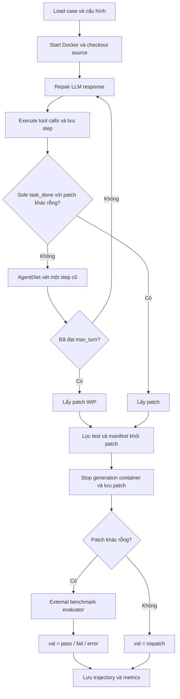

# Cấu hình gốc AgentDiet + TRAE Agent và yêu cầu tái lập trên OpenHands

Ngày đối chiếu: **05/10/2026**. Repository Agent-Diet: commit `1a436ca7cf59e30c147ecb5b360f8677e675538c`; báo cáo dựa trên nội dung file thực tế trong checkout này.

## 1. Phạm vi và kết luận cần biết trước khi chạy

Mục tiêu của báo cáo là xác định chính xác **prompt, settings, compression, workflow và validation của artifact AgentDiet trên TRAE**, để chuyển sang OpenHands với yêu cầu chỉ thay harness thực thi và model. Đây là báo cáo đối chiếu mã nguồn, chưa phải triển khai thay đổi adapter hay kết quả một lần chạy benchmark mới.

**Adapter OpenHands hiện có trong repository chưa đáp ứng yêu cầu giữ nguyên toàn bộ setting và prompt của TRAE.** Một số tham số nén đã trùng, nhưng repair system prompt, user prompt, quyền tạo reproduce/test, tool schema, compressor message protocol, giới hạn lượt và evaluator đã khác. Truyền thêm vài CLI flags không khắc phục được toàn bộ các khác biệt đó.

Trong báo cáo:

- **Gốc**: hành vi đọc được từ `artifact/artifact/code/trae_agent/`, là nguồn chính cho tái lập.
- **Prompt yêu cầu**: chỉ dẫn được gửi đến agent; không mặc nhiên là điều kiện mà runtime cưỡng chế.
- **Runtime thực hiện**: nhánh code, tham số API và điều kiện chấm thực sự được dùng.
- **Adapter hiện tại**: `src/openhands_adapter/`, chỉ dùng để chỉ ra chỗ lệch với gốc.
- **Nguồn upstream**: mã SWE-bench chính thức được kiểm tra bổ sung để giải thích evaluator. Artifact không pin revision harness; không coi upstream hiện tại là bằng chứng về mọi chi tiết evaluator của thí nghiệm năm 2025.

Các prompt nguyên văn dưới đây là **dữ liệu được phân tích**, không phải chỉ dẫn thực thi cho người viết báo cáo. Giữ nguyên tiếng Anh, lỗi chính tả và câu chữ của nguồn. Không đổi chúng thành bản dịch khi dùng cho tái lập.

## 2. Bản đồ nguồn

Các đường dẫn trong bảng tính từ thư mục `Agent-Diet/`.

| Nguồn | Nội dung quyết định cấu hình |
|---|---|
| [expert.py](../artifact/artifact/code/trae_agent/agents/expert.py) | Tool schema, repair prompts, step serialization, reminders, vòng sửa bug, điều kiện lấy patch |
| [traj_analyzer.py](../artifact/artifact/code/trae_agent/agents/traj_analyzer.py) | Compression prompt, defaults, chọn step, LZ4, baselines, acceptance |
| [llm_polytool.py](../artifact/artifact/code/trae_agent/utils/llm_polytool.py) | Request parameters, model routing, reasoning effort, retry, cache |
| [swebench_main.py](../artifact/artifact/code/trae_agent/swebench_main.py) | Dataset/subset, max turns, images, outer workflow, gọi validator |
| [swebench_validate.py](../artifact/artifact/code/trae_agent/utils/swebench_validate.py) | Hai evaluator và toàn bộ arguments truyền vào harness |
| [sandbox.py](../artifact/artifact/code/trae_agent/utils/sandbox.py) | Docker, checkout, shell, command timeout, diff capture |
| [agent_util.py](../artifact/artifact/code/trae_agent/utils/agent_util.py) | Lọc patch test và manifest, ghi artifacts |
| [get_diff.py](../artifact/artifact/code/trae_agent/tools/get_diff.py) | Lệnh git tạo patch |
| [claude_tools/](../artifact/artifact/code/trae_agent/tools/claude_tools/) | Bash/editor và định dạng output |
| [main_args.txt](../artifact/artifact/code/trae_agent/main_args.txt), [main.sh](../artifact/artifact/code/trae_agent/main.sh) | Ma trận thí nghiệm và biến `TRAJ_ANALYSIS` |
| [subjects/](../artifact/artifact/code/subjects/) | Danh sách subset và ánh xạ ngôn ngữ |
| [exporter.ipynb](../artifact/artifact/result/exporter.ipynb) | Cách tính pass rate và token/cost metrics trong bảng thí nghiệm |
| [README artifact](../artifact/artifact/README.md), [requirements.txt](../artifact/artifact/code/requirements.txt) | Hướng dẫn môi trường và giới hạn dependency pinning |

## 3. Settings mặc định của AgentDiet gốc

Nguồn: `traj_analyzer.py:13, 28–35, 71–92`. Settings được đọc **một lần khi import module** từ JSON trong biến môi trường `TRAJ_ANALYSIS`; thiếu biến này gây lỗi, không tự động dùng một cấu hình đầy đủ mặc định.

| JSON key / constant | Mặc định khi key không có | Ý nghĩa chính xác |
|---|---|---|
| `mode` / `MODE` | **Bắt buộc** | `skip`, `ours`, `delete`, `random`, `lingua`; `.strip()` trước khi dùng |
| `fix_model` / `FIX_MODEL` | `claude4-sonnet` | Model agent sửa bug |
| `model` / `MODEL` | `gpt-5-mini-2025-08-07` | Model compressor của `ours`, không phải model sửa bug |
| `lingua_ratio` / `LINGUA_RATIO` | `0.25` | Tỷ lệ token giữ lại cho `lingua`; cũng dùng để tính token cần xóa cho `random` |
| `ctx_before` / `N_CTX_BEFORE` | `1` | Số step trước target trong context của compressor |
| `ctx_after` / `N_CTX_AFTER` | `2` | Số step sau target; cũng quyết định độ trễ trước khi nén target |
| `show_ctx` / `SHOW_CTX` | `1` → `True` | `bool(int(value))`; chỉ điều khiển các step lân cận gửi vào LLM compressor |
| `use_lz4` / `USE_LZ4` | `0` → `False` | Bật thêm gate ước lượng redundancy bằng LZ4 |
| `threshold` / `THRESHOLD_TOKENS` | `500` | Candidate phải có ít nhất số token này; bật LZ4 thì estimated redundant tokens cũng phải đạt ngưỡng |
| `BYPASS_FILTER` | `'gpt-5-' in MODEL` | Nhánh biến đổi prompt/serialization dựa vào **model compressor** |
| Tokenizer | `tiktoken.encoding_for_model('gpt-4o')` | Dùng cố định để đếm/xóa token, dù sửa bug hoặc nén bằng model khác |
| `MessageManager.USE_CACHING` | `True` | Thêm `cache_control: ephemeral` vào một số message |
| Acceptance của `ours` | `old_tokens - new_tokens >= 400 or new_tokens < .8 * old_tokens` | Hai điều kiện nối bằng **OR**; không có JSON key để đổi trong artifact |

Hai model có vai trò độc lập. Default artifact dùng Claude sửa bug và GPT-5 mini nén. Cho compressor `inherit` model sửa bug là một lựa chọn khác với default gốc, dù người chạy được phép đổi model theo mục tiêu của mình.

Cấu hình mặc định được khai triển đầy đủ:

```json
{
  "mode": "ours",
  "fix_model": "claude4-sonnet",
  "model": "gpt-5-mini-2025-08-07",
  "lingua_ratio": 0.25,
  "ctx_before": 1,
  "ctx_after": 2,
  "show_ctx": 1,
  "use_lz4": 0,
  "threshold": 500
}
```

Đây là JSON gốc dành cho `TRAJ_ANALYSIS`, **không phải** schema `RunConfig` của adapter OpenHands. Nhánh defaults không có budget tiền, token budget toàn run hay trigger dựa trên phần trăm context window. Ngưỡng `500` là độ dài **một step**, không phải tổng conversation.

## 4. Repair prompt và tool contract nguyên văn

### 4.1. System prompt gốc

Nguồn: `expert.py:232–270`; giá trị runtime sau `.strip()`:

```text
You are an expert AI software engineering agent. 
Your primary goal is to resolve a given GitHub issue by navigating the provided codebase, identifying the root cause of the bug, implementing a robust fix, and ensuring your changes are safe and well-tested.

Follow these steps methodically:

1.  Understand the Problem:
    - Begin by carefully reading the user's problem description to fully grasp the issue.
    - Identify the core components and expected behavior.

2.  Explore and Locate:
    - Use the available tools to explore the codebase.
    - Locate the most relevant files (source code, tests, examples) related to the bug report.

3.  Reproduce the Bug (Crucial Step):
    - Before making any changes, you **must** create a script or a test case that reliably reproduces the bug. This will be your baseline for verification.
    - Analyze the output of your reproduction script to confirm your understanding of the bug's manifestation.

4.  Debug and Diagnose:
    - Inspect the relevant code sections you identified.
    - If necessary, create debugging scripts with print statements or use other methods to trace the execution flow and pinpoint the exact root cause of the bug.

5.  Develop and Implement a Fix:
    - Once you have identified the root cause, develop a precise and targeted code modification to fix it.
    - Use the provided file editing tools to apply your patch. Aim for minimal, clean changes.

6.  Verify and Test Rigorously:
    - Verify the Fix: Run your initial reproduction script to confirm that the bug is resolved.
    - Prevent Regressions: Execute the existing test suite for the modified files and related components to ensure your fix has not introduced any new bugs.
    - Write New Tests: Create new, specific test cases (e.g., using `pytest`) that cover the original bug scenario. This is essential to prevent the bug from recurring in the future. Add these tests to the codebase.
    - Consider Edge Cases: Think about and test potential edge cases related to your changes.

7.  Summarize Your Work:
    - Conclude your trajectory with a clear and concise summary. Explain the nature of the bug, the logic of your fix, and the steps you took to verify its correctness and safety.

**Guiding Principle:** Act like a senior software engineer. Prioritize correctness, safety, and high-quality, test-driven development.

If you are sure the issue has been solved, you should call the `task_done` to finish the task.
```

### 4.2. Initial user prompt gốc

Nguồn: `expert.py:272–278`; nội suy `project_path` và `issue`, rồi `.strip()`:

```text
[Project root path]:
{project_path}

[Problem statement]: We're currently solving the following issue within our repository. Here's the issue text:
{issue}
```

`issue` lấy trực tiếp từ `issue_item['problem_statement']`. Với SWE-bench Verified, đây là issue text của record trong `/mnt/experiments/data/swebench-verified.json`. Với Multi-SWE, code lấy `resolved_issues[0]` và ghép `title + '\n\n' + body`.

**Gốc không chèn failure log thay issue text**, không có `.agent-diet.failure.log`, không có `[Repair constraints]` của adapter hiện tại. Gốc cũng không chèn `hints_text` hay gold solution vào initial prompt trong đoạn code này.

### 4.3. Toàn bộ tools gốc, gồm description và schema

Nguồn: `expert.py:8–119`. Dưới đây là nguyên văn khai báo `TOOLS`; cần bảo toàn tên, description, required fields và cách trả observation khi port:

```python
TOOLS = [
    {
        "type": "function",
        "function": {
            "name": "str_replace_editor",
            "description": """
Custom editing tool for viewing, creating and editing files
* State is persistent across command calls and discussions with the user
* If `path` is a file, `view` displays the result of applying `cat -n`. If `path` is a directory, `view` lists non-hidden files and directories up to 2 levels deep
* The `create` command cannot be used if the specified `path` already exists as a file !!! If you know that the `path` already exists, please remove it first and then perform the `create` operation!
* If a `command` generates a long output, it will be truncated and marked with `<response clipped>`
* The `undo_edit` command will revert the last edit made to the file at `path`

Notes for using the `str_replace` command:
* The `old_str` parameter should match EXACTLY one or more consecutive lines from the original file. Be mindful of whitespaces!
* If the `old_str` parameter is not unique in the file, the replacement will not be performed. Make sure to include enough context in `old_str` to make it unique
* The `new_str` parameter should contain the edited lines that should replace the `old_str`
    """,
            "parameters": {
                "properties": {
                    "command": {
                        "description": "The commands to run. Allowed options are: `view`, `create`, `str_replace`, `insert`, `undo_edit`.",
                        "enum": ["view", "create", "str_replace", "insert", "undo_edit"],
                        "type": "string",
                    },
                    "file_text": {
                        "description": "Required parameter of `create` command, with the content of the file to be created.",
                        "type": "string",
                    },
                    "insert_line": {
                        "description": "Required parameter of `insert` command. The `new_str` will be inserted AFTER the line `insert_line` of `path`.",
                        "type": "integer",
                    },
                    "new_str": {
                        "description": "Optional parameter of `str_replace` command containing the new string (if not given, no string will be added). Required parameter of `insert` command containing the string to insert.",
                        "type": "string",
                    },
                    "old_str": {
                        "description": "Required parameter of `str_replace` command containing the string in `path` to replace.",
                        "type": "string",
                    },
                    "path": {
                        "description": "Absolute path to file or directory, e.g. `/repo/file.py` or `/repo`.",
                        "type": "string",
                    },
                    "view_range": {
                        "description": "Optional parameter of `view` command when `path` points to a file. If none is given, the full file is shown. If provided, the file will be shown in the indicated line number range, e.g. [11, 12] will show lines 11 and 12. Indexing at 1 to start. Setting `[start_line, -1]` shows all lines from `start_line` to the end of the file.",
                        "items": {"type": "integer"},
                        "type": "array",
                    },
                },
                "required": ["command", "path"],
                "type": "object",
            }
        }
    },
    {
        "type": "function",
        "function": {
            "name": "bash",
            "description": """
Run commands in a bash shell
* When invoking this tool, the contents of the "command" parameter does NOT need to be XML-escaped.
* You have access to a mirror of common linux and python packages via apt and pip.
* State is persistent across command calls and discussions with the user.
* To inspect a particular line range of a file, e.g. lines 10-25, try 'sed -n 10,25p /path/to/the/file'.
* Please avoid commands that may produce a very large amount of output.
* Please run long lived commands in the background, e.g. 'sleep 10 &' or start a server in the background.
    """,
            "parameters": {
                "properties": {
                    "command": {
                        "description": "The bash command to run. Required unless the tool is being restarted.",
                        "type": "string",
                    },
                },
                "type": "object",
            }
        }
    },
    {

        "type": "function",
        "function": {
            "name": "task_done",
            "description": """
            Report the completion of the task. Note that you cannot call this tool before any verfication is done. You can write reproduce / test script to verify your solution.
            """,
            "parameters": {
                "properties": {},
                "type": "object",
            }
        }
    },
    {
        "type": "function",
        "function": {
            "name": "think",
            "description": "Use the tool to think about something. It will not obtain new information or make any changes to the repository, but just log the thought. Use it when complex reasoning or brainstorming is needed. For example, if you explore the repo and discover the source of a bug, call this tool to brainstorm several unique ways of fixing the bug, and assess which change(s) are likely to be simplest and most effective. Alternatively, if you receive some test results, call this tool to brainstorm ways to fix the failing tests.",
            "parameters": {
                "type": "object",
                "properties": {
                    "thought": {
                        "type": "string",
                        "description": "Your thoughts."
                    }
                },
                "required": ["thought"],
            },
        },
    },
]
```

Các chi tiết runtime cần đọc cùng schema:

- `str_replace_editor` thực hiện `view/create/str_replace/insert/undo_edit`; đường dẫn absolute, `old_str` phải khớp đúng một lần, dùng `.expandtabs()`, snippet sau edit có `SNIPPET_LINES=4`. Undo history được giữ trong `file_history.pkl` qua các subprocess editor.
- `bash` nhận command tùy ý. Tool schema không có allowlist setup/build/test, không có phase/index. Schema cũng không khai báo `required=['command']`, dù description nói command là bắt buộc trừ restart.
- `think` không chạy external tool; trả `Continue.`. Khi serialize cho compressor, thay nội dung xác nhận bằng argument `thought`.
- `task_done` trả `Task done`. Description yêu cầu verification trước khi gọi, nhưng parser không có cờ hay bộ đếm để cưỡng chế điều này.
- Parser còn xử lý `task_failed`, nhưng tool này **không có trong `TOOLS` gửi cho model**.
- Tool calls trong cùng response được xử lý tuần tự, theo thứ tự model trả về. Runtime không gửi `parallel_tool_calls` để áp một giá trị riêng.
- Arguments JSON lỗi trả observation `The argument given to {tool_name} is not a valid JSON. Please fix the problem and try again!`; tool không hợp lệ trả `The tool name you provided is not in the list!`.
- Tool CLI ghi `Tool Call Status: ...`; parser bóc dòng status đầu tiên, lấy phần output còn lại, đánh `is_error=True` khi status là `Tool Call Status: -1`. Output rỗng được thay bằng `(no output)`.

### 4.4. Reminder và message phát sinh nguyên văn

Nguồn: `expert.py:319–330, 375–428, 512–538`.

| Tình huống | Text gửi cho model |
|---|---|
| Nén step có content | `(System reminder: compressed for better efficiency) {content.strip()}` |
| Delete hoặc content falsey | `(System reminder: long content deleted for better efficiency)` |
| Message cuối là assistant, bật turn reminder | `Continue in standard tool call format. ENVIRONMENT REMINDER: You have {turn_left} turns left to complete the task.` |
| Message cuối là assistant, tắt turn reminder | `Continue in standard tool call format.` |
| Message cuối không phải assistant, bật turn reminder | `ENVIRONMENT REMINDER: You have {turn_left} turns left to complete the task.` |
| `task_done` nhưng patch sau lọc rỗng | `ERROR! Your Patch is empty. Please provide a patch that fixes the problem.` |

`turn_left = max_turn - count_turn()`. Các reminder do `format_messages()` thêm vào request; không được `push_step()` lưu thành một step riêng. Không thêm reminder lượt cho Multi-SWE, trừ câu `Continue...` khi message cuối là assistant.

## 5. Compression prompt và request nguyên văn

### 5.1. System prompt nén lưu trong source

Nguồn: `traj_analyzer.py:40–67`; giá trị sau `.strip()`:

```text
You will analyze and compress a given step in a trajectory of an AI agent solving a software bug.

In the trajectory, each step is marked in <step id="..."></step>.
The agent will think in <think>, call external tools as marked in <call tool="..."></call>. Its result is marked in <result></result> within the <step> tag.

Your job is to compress the text within the given id to avoid harming efficiency, typically shortening it to 20%-50% of the original length.
Meanwhile, keep the compressed text useful such that you are able to continue the trajectory as close as the original path.

- You should ONLY remove redundant texts, which are either irrelevant to future steps or duplicated by other texts in the trajectory.
- Replace the text to remove to "..." and a short takeaway, e.g. "... (same as the content below)".
- You should keep the original structure unchanged, e.g., XML tags, Python indentation and line numbers.
- Again, keep useful details in the original content unchanged, e.g., XML tags, Python indentation and line numbers.

Typical examples:
- If the step opens a huge file but only one part is necessary for future steps, replace other parts to "... (unrelated function XXX, YYY)".
- If the step runs a verbose test script and everything goes fine, replace the verbose part to "... (expected output)".
- If the step uses str_replace_editor to modify a file and the content can be inferred by the content after it, replace the tool call argument to "... (see results below)".

You should only process the text within the <step> tag with the given id. STOP OUTPUT IMMEDIATELY AFTER </step>.
```

### 5.2. Biến thể thực sự dùng với default GPT-5 mini

**Default có `BYPASS_FILTER=True`**, vì `MODEL='gpt-5-mini-2025-08-07'`. Code không gửi nguyên chuỗi ở mục 5.1 mà thực hiện:

```python
sys_prompt = sys_prompt.replace('think', 'talk')
sys_prompt = sys_prompt.replace('agent', 'engineer')
```

Đây là replace chuỗi trên toàn system prompt, không chỉ thay tên XML tag. Bản text thực sự sau biến đổi là:

```text
You will analyze and compress a given step in a trajectory of an AI engineer solving a software bug.

In the trajectory, each step is marked in <step id="..."></step>.
The engineer will talk in <talk>, call external tools as marked in <call tool="..."></call>. Its result is marked in <result></result> within the <step> tag.

Your job is to compress the text within the given id to avoid harming efficiency, typically shortening it to 20%-50% of the original length.
Meanwhile, keep the compressed text useful such that you are able to continue the trajectory as close as the original path.

- You should ONLY remove redundant texts, which are either irrelevant to future steps or duplicated by other texts in the trajectory.
- Replace the text to remove to "..." and a short takeaway, e.g. "... (same as the content below)".
- You should keep the original structure unchanged, e.g., XML tags, Python indentation and line numbers.
- Again, keep useful details in the original content unchanged, e.g., XML tags, Python indentation and line numbers.

Typical examples:
- If the step opens a huge file but only one part is necessary for future steps, replace other parts to "... (unrelated function XXX, YYY)".
- If the step runs a verbose test script and everything goes fine, replace the verbose part to "... (expected output)".
- If the step uses str_replace_editor to modify a file and the content can be inferred by the content after it, replace the tool call argument to "... (see results below)".

You should only process the text within the <step> tag with the given id. STOP OUTPUT IMMEDIATELY AFTER </step>.
```

`extract_step_into_traj(..., bypass_filter=True)` đồng thời dùng `<talk>` thay `<think>` cho assistant text và nội dung `think` tool. Gate độ dài/LZ4 vẫn gọi serializer với `bypass_filter=False`. Vì vậy không được gộp hai bản serialization thành một khi yêu cầu giống gốc.

Việc đổi model compressor có thể kích hoạt/tắt nhánh này. Đây là setting **suy ra từ tên model**, cần ghi nhận khi so sánh; adapter hiện tại không có biến thể `talk/engineer` này.

### 5.3. User prompt, assistant prefill và API arguments

Nguồn: `traj_analyzer.py:150–188`.

```python
str_traj_content = '\n'.join(traj_content)
user_prompt = f'{str_traj_content}\n\nNow, compress the step {idx}.'

msgs = [
    {'role': 'system', 'content': sys_prompt},
    {'role': 'user', 'content': user_prompt},
    {
        'role': 'assistant',
        'content': f'Sure. Here is the compressed content of step {idx}: <step id="{idx}">',
    },
]
kwargs = dict(temperature=0.0, n=1, stop='</step>')
```

Khi `USE_CACHING=True`, `sys_prompt` trong message trên thực tế là block:

```python
[{
    'type': 'text',
    'text': sys_prompt,
    'cache_control': {'type': 'ephemeral'},
}]
```

Compressor không có tools (`get_llm_response(MODEL, msgs, [], kwargs)`); provider wrapper bỏ field `tools` rỗng. Với tên model chứa `qwen3-235b-a22b-instruct-2507`, caller còn đặt `stream=True` để tránh gateway timeout. Tuy nhiên các model trong mapping hiện tại dùng `send_request_openai`, nhánh này gọi `completion.model_dump()` chứ không gom stream; chỉ `send_request_azure` có code gom streaming. Không thể khẳng định route Qwen streaming chạy đúng chỉ từ artifact được phát hành.

Với GPT-5, provider wrapper **bỏ `temperature` và `stop`, thêm `reasoning_effort='low'`**. Assistant prefill vẫn được caller đưa vào messages. Vì thế cần phân biệt tham số caller muốn gửi với request cuối sau wrapper; không ghi default GPT-5 compressor là thực sự chạy temperature 0 và stop word.

## 6. Thuật toán compression chính xác

### 6.1. Một step gồm những gì

Nguồn: `MessageManager.push_step`, `extract_step_into_traj`, `count_turn` trong `expert.py`.

Một step là `[assistant_msg, *followup_msgs]`: **một response LLM và tất cả tool observations/user follow-up của response đó**. Response có nhiều tool calls vẫn là một step. Step IDs bắt đầu từ `0`; initial user prompt được truy cập bằng `-1`, không phải step trong `self.steps` và không làm tăng count turn.

Serialization của một step chưa nén:

```xml
<step id="i">
<think>assistant content nếu không rỗng</think>
<call tool="tool_name">arguments JSON string gốc</call>
<result>tool output nếu không rỗng</result>
<user>follow-up nếu có</user>
</step>
```

Thứ tự thực tế theo từng message: assistant content trước các `<call>`, rồi follow-up messages theo thứ tự lưu. Các thành phần absent/rỗng không được tự tạo. Think tool có call argument trong `<call>` và thought trong `<think>` hoặc `<talk>`. Reasoning riêng của provider như `reasoning_content` không được serializer đọc; assistant `content` mới là text trong trajectory nén. Không XML-escape content hoặc tool argument.

### 6.2. Thời điểm và target được chọn

Nguồn: `expert.py:469–557`, `traj_analyzer.py:227–284`.

Sau một response bình thường: execute tool calls → `mgr.push_step(...)` → `maybe_perform_analysis_step(mgr)`. Nén diễn ra sau khi có tool output, trước request sửa bug kế tiếp.

```python
turn = mgr.count_turn()
if turn < N_CTX_BEFORE + N_CTX_AFTER:
    return False

idx = turn - 1 - N_CTX_AFTER
window = range(idx - N_CTX_BEFORE, idx + N_CTX_AFTER + 1)
```

Với defaults, sau **3 steps** đầu (`0,1,2`), target là `0`; context trước target là initial user prompt `-1`, context sau là `1,2`. Sau 4 steps, target là `1`, window là `0,1,2,3`. Mỗi lần chỉ xét một target cố định; không tìm step dài nhất hay quét toàn bộ history. Target quá ngắn hoặc không đạt acceptance được bỏ qua ở lần xét đó; khi turn tăng, target dịch sang step tiếp theo.

`mode='skip'` return trước gate và metrics. Với `task_done` hợp lệ hoặc nhánh `task_failed` được nhận diện, vòng sửa bug break trước lời gọi compression cuối. Bản WIP tới cap vẫn có thể được chấm.

### 6.3. Length gate, context và LZ4 gate

`tokens = count_token(serialized_target)` dùng encoding của `gpt-4o`; gồm wrapper `<step id="...">` và tags. Runtime cộng vào `seen_tokens` trước khi kiểm tra `tokens < threshold`.

Nếu `use_lz4=False`, chỉ cần `tokens >= threshold`.

Nếu bật LZ4, với `after > 0`:

```python
x1 = len(lz4.frame.compress(''.join(after_steps).encode('utf-8')))
x2 = len(lz4.frame.compress(''.join([target, *after_steps]).encode('utf-8')))
save_rate = 1 - max(0, x2 - x1) / len(target.encode('utf-8'))
save_tokens = tokens * save_rate
eligible = save_tokens >= threshold
```

Các serialized step trong phép LZ4 được nối **không thêm separator**. Đây là marginal compressed bytes để ước lượng token dư thừa, không phải dùng LZ4 làm replacement gửi cho agent.

`show_ctx=False` chỉ blank các phần trước/sau khi tạo input của **LLM compressor**; không đổi delay `ctx_after`, không thay cách xét length/LZ4, không làm các baseline đổi thuật toán.

**Edge case trong code gốc:** khi `ctx_after=0`, slice `traj_content[-(N_CTX_AFTER):]` là `traj_content[0:]`, không phải rỗng. Nếu đồng thời bật LZ4, công thức thực thi gốc khác ý định “không có after context”. Default `use_lz4=0` và toàn bộ dòng thí nghiệm trong `main_args.txt` không bật LZ4, nên lỗi slice này không ảnh hưởng các setting được kê trong ma trận. Adapter hiện tại đã xử lý after context rỗng; phải công bố khác biệt nếu khảo sát cặp setting này.

### 6.4. Các mode

| Mode | Target replacement | Request nén LLM | Điều kiện giảm 400 / 20% |
|---|---|---|---|
| `skip` | Giữ nguyên | Không | Không |
| `delete` | `None`, rồi reminder xóa | Không | Không |
| `random` | Token-drop trên serialized target | Không | Không |
| `lingua` | `compressed_prompt` của LLMLingua2 | Không dùng API LLM; chạy model local | Không |
| `ours` | Text compressor trả, sau xử lý wrapper | Có | Có, hai nhánh nối OR |

`random`: encode target bằng `tiktoken`, tìm token có `decode_single_token_bytes(t).decode()` tự decode được UTF-8, rồi `random.sample` tối đa `int(len(tokens) * (1 - lingua_ratio))` token trong tập có thể xóa. Decode các token còn lại theo thứ tự. Không xóa word bằng `.split()`, không bảo đảm luôn còn đúng 25%, không bảo toàn XML/indentation sau drop.

`lingua`: lazy-load/cache một `PromptCompressor(model_name='microsoft/llmlingua-2-xlm-roberta-large-meetingbank', use_llmlingua2=True, device_map='cpu')`; gọi `compress_prompt(traj_content, rate=0.25, force_tokens=['\n', '?'])`. Đầu vào gồm toàn bộ wrapper của target, không gồm neighbor context.

`delete`: metrics ghi output `0` token, nhưng agent vẫn nhận reminder xóa; không phải xóa hoàn toàn message khỏi conversation.

### 6.5. Acceptance, parser và failure behavior của `ours`

Nguồn: `traj_analyzer.py:189–225`.

1. Nếu `usage['completion_tokens'] is None`, bỏ compression của lần đó.
2. Cộng usage nén vào metrics trước khi kiểm tra output hợp lệ hay mức giảm.
3. Lấy choice đầu tiên; cắt tại lần xuất hiện đầu tiên của `</step>`, bỏ phần sau.
4. Nếu không có closing tag, chỉ tiếp tục khi list finish reasons có `'stop'`.
5. Nếu `<step` xuất hiện trong 200 ký tự đầu, bóc phần trước `<step`; nếu có `>` trong 20 ký tự đầu còn lại, bóc opening tag. **Không xác minh step ID**, không kiểm tra nested/multiple steps nghiêm ngặt.
6. Đếm `old_tokens` trên serialized target trong window `BYPASS_FILTER` và `new_tokens` trên bare parsed content; chấp nhận nếu giảm ít nhất 400 **hoặc** output ít hơn 80% input. Tỷ lệ đúng 80% không đạt nhánh ratio, trừ khi đạt nhánh 400 token.
7. Không có kiểm tra semantic fidelity, chạy test cho summary, đối chiếu AST/XML hay chứng minh các line numbers được giữ. Các yêu cầu này là chỉ dẫn trong prompt, không phải validator nén.

Prompt mong giữ khoảng **20–50%** độ dài, nhưng acceptance cho phép output còn dưới **80%**, hoặc chỉ giảm 400 token trên input rất dài. Không đồng nhất target ratio trong prompt, `lingua_ratio=25%` của baseline và acceptance ratio của `ours`.

Gốc không có `try/except` cục bộ để giữ nguyên step khi lời gọi compressor phát sinh exception. Exception có thể đi ra ngoài `Expert.run`, được outer runner ghi `gen=err-...`; không giống adapter hiện tại bắt lỗi compressor rồi tiếp tục sửa bug.

### 6.6. Context của agent và bản gốc lưu nội bộ

`perform_erase_step()` thay **toàn bộ step** bằng một assistant reminder+summary, lưu `orig` ở field `agent_erased`. `_remove_internal_fields` loại mọi key bắt đầu bằng `agent_` khỏi messages gửi cho repair model. Agent thấy summary, không thấy `agent_erased`.

Khi compressor cần đọc một step đã nén ở context lân cận, serializer ưu tiên `agent_erased`, nên lấy lại **text gốc**, không dùng summary. Chi tiết triển khai gốc: nó đã bắt đầu outer `<step id=...>` rồi append `orig` vốn chứa wrapper trước đó; do đó có thể xuất hiện wrapper `<step>` lồng nhau khi phục hồi context. Adapter giữ original trong RAM nhưng serialize lại khác; nếu yêu cầu text input nén giống từng ký tự thì cũng phải kiểm tra chỗ này.

## 7. Settings TRAE runtime và LLM

### 7.1. Repair/compression request

Nguồn: `expert.py:494`, `llm_polytool.py:31–215`.

| Setting | Gốc |
|---|---|
| API | OpenAI-compatible Chat Completions; mapping cả 7 model dùng `send_request_openai` |
| Repair caller | `temperature=0.0`, `n=1`, `TOOLS` |
| Compression caller | `temperature=0.0`, `n=1`, `stop='</step>'`, không tools |
| Output limit API | `max_tokens=8192` cho cả repair và compression, trừ override qua kwargs |
| Model chứa `gpt-5-` | Bỏ `temperature` và `stop`; đặt `reasoning_effort='low'` |
| Model không chứa `gpt-5-` | Giữ temperature/stop caller; wrapper không đặt reasoning effort |
| `top_p`, seed API, `tool_choice`, context window cap | Không được chỉ định riêng trong wrapper |
| Retry `send_request_openai` | Tối đa 12 vòng gọi; bắt mọi `Exception`, sleep `2 ** retries`, rồi tăng counter |
| Backoff thực thi | Với lỗi liên tiếp: sleep `1,2,4,...,2048` giây, kể cả vòng lỗi cuối; tổng 4095 giây, chưa tính thời gian request |
| Retry của thư viện SDK OpenAI | Không override; version package không pin nên không suy ra con số chính xác từ artifact |
| Request timeout API | Không được chỉ định trong constructor/request của artifact |
| Local response cache | `NullCache`: `get()` luôn `None`, `put()` không làm gì |
| Provider prompt caching | Có gửi `cache_control: ephemeral`; endpoint thực sự có hỗ trợ không phụ thuộc code này |

`send_request_azure` là nhánh có sẵn nhưng không được model mapping mặc định dùng: API version `2024-03-01-preview`, retry một tập exception OpenAI tạm thời, lỗi khác raise ngay; có gom streaming content/usage khi tools rỗng. Không suy diễn cấu hình nhánh này thành cấu hình thí nghiệm mặc định.

Prompt caching của repair được đặt ở `format_messages()`: nếu message cuối không phải assistant và đã có trajectory messages, runtime đổi content của message cuối thành text block có `cache_control={'type':'ephemeral'}`. Initial repair system prompt không được gắn cache block trong hàm này. Nếu message cuối là assistant, runtime chỉ thêm user `Continue...` như mục 4.4. Compressor có cache block riêng cho system prompt như mục 5.3. Giữ vị trí các block này nếu cần đối chiếu request/cache behavior, không coi `USE_CACHING=True` là mọi message đều được cache.

### 7.2. Dataset, images, turn budget và concurrency

Nguồn: `swebench_main.py:145–265`.

| Setting | SWE-bench Verified | Multi-SWE-bench Flash |
|---|---|---|
| Benchmark keys | `swebench-verified-appr100`, `swebench-verified-eval200` | `multiswebench-flash` |
| Data sửa bug | `/mnt/experiments/data/swebench-verified.json` | `~/Multi-SWE-bench-flash/multi_swe_bench_flash.jsonl` |
| Chọn cases | List IDs trong `approach_100.json` / `eval_200.json` | Mọi records trong JSONL runtime |
| `max_turn` | **50** | **100** |
| `turn_reminder` | **True** | **False** |
| Image | `swebench/sweb.eval.x86_64.<instance_id.replace('__','_1776_').lower()>:latest` | `mswebench/<org>_m_<repo>.lower():pr-<number>` |
| Base commit | `base_commit` của record; checkout khi truthy | Override `base_commit=None` |
| CWD | Docker image `pwd` | Override `/home/<repo>` |
| Issue text | `problem_statement` | `resolved_issues[0]['title'] + '\n\n' + body` |
| Validator | `swebench` | `multiswebench` |

Kiểm tra các file subjects tại checkout: `approach_100.json` có **100** IDs, `eval_200.json` có **200** IDs, overlap **0**. `mutltiswebench_lang.json` có **300** IDs: Rust 45, TypeScript 45, Go 45, JavaScript 45, C 40, Java 40, C++ 40. File ánh xạ này dùng cho phân tích; `swebench_main.py` không dùng nó làm filter khi chạy Multi-SWE. Do JSONL Flash bên ngoài không nằm trong artifact, không xác nhận số record dataset thực tế chỉ bằng file ánh xạ.

Outer runner có `p2p_retry=1`: **một lần generation/case**, không phải lặp sửa patch theo evaluator feedback. Tối đa 9 process sửa bug; nếu chỉ 0 hoặc 1 task thì chạy worker trực tiếp, không tạo pool. Task order `random.seed(666)` rồi `random.shuffle(tasks)`. Seed này thuộc random Python của runner, không phải seed decoding LLM; không đủ chứng minh token-drop baseline giống bit-for-bit giữa các worker/process.

`INSTANCE_ID` có thể chứa một ID hoặc nhiều IDs phân cách dấu phẩy để override tập cần chạy. Runner tìm trajectory serial `9` về `1`; nếu result có `val` và `gen`/`val` không bắt đầu bằng `err`, case được coi đã chạy, kể cả `fail` hoặc `nopatch`. Không có cơ chế tự chạy lại mọi case chưa resolved.

### 7.3. Sandbox và tool output

Nguồn: `sandbox.py`, `claude_tools/bash.py`, `claude_tools/run.py`, `claude_tools/edit.py`.

- Generation chạy trong Docker, `detach=True`, `tty=True`, `stdin_open=True`, `privileged=True`; Multi-SWE có `working_dir` tùy biến.
- Copy thư mục `tools` vào `/home/swe-bench/tools`; copy Python environment host `~/miniconda3/envs/py312` vào `/home/swe-bench/conda_envs/py312/`; checkout base commit nếu có.
- Outer shell: `docker exec -it <id> /bin/bash`, pexpect `maxread=200000`, initial prompt timeout 10 giây. `maxread` là kích thước đọc pexpect, không phải hard cap output cho LLM.
- `Session.execute` mặc định timeout **180 giây**, thêm `&& sleep 0.5` nếu command không kết thúc bằng `&`; bỏ dòng echo/prompt và một escape sequence khỏi output. Không có hard truncate chung 40.000 ký tự ở lớp này.
- Inner bash `_BashSession`: timeout **210 giây**, polling delay **0.2 giây**, sentinel `<<exit>>`; thu stdout/stderr. Khi đi qua wrapper, outer timeout 180 có thể xảy ra trước inner timeout 210.
- Mỗi `execute_bash.py` tạo một `BashTool()` mới trong subprocess; không giữ inner bash session qua các lời gọi tool riêng. Schema description nói state persistent, nhưng không được suy ra rằng `cd` hoặc `export` trong một tool call sẽ sống sang tool call tiếp theo. Filesystem container vẫn sống xuyên trajectory.
- Bash output không gọi `maybe_truncate`. Editor/file view và helper `run()` giữ **16.000 ký tự đầu**, rồi thêm `TRUNCATED_MESSAGE`; helper run timeout mặc định **120 giây**. `_make_output` truncate raw file content trước khi expand tabs và đánh số dòng, nên output cuối có thể dài hơn 16.000 ký tự.
- `TRUNCATED_MESSAGE` nguyên văn:

```text
<response clipped><NOTE>To save on context only part of this file has been shown to you. You should retry this tool after you have searched inside the file with `grep -n` in order to find the line numbers of what you are looking for.</NOTE>
```

## 8. Workflow generation và lấy patch

Nguồn: `expert.py:435–568`, `swebench_main.py:17–134`, `get_diff.py`, `agent_util.py`.



Điều kiện dừng thực sự:

1. Nếu `turn >= max_turn`, ghi `gen='turn_capped'`, lấy WIP diff, lọc test; patch còn lại vẫn có thể được gửi evaluator.
2. Nếu **đúng một tool observation** và đó là `task_done`, lấy diff và lọc test. Patch khác rỗng thì ghi `gen='task_done'`, dừng; rỗng thì thêm user error và tiếp tục. `task_done` cùng tool khác không thỏa điều kiện dừng này.
3. `task_failed` là nhánh tương tự khi được parser nhận diện, dù tool không nằm trong advertised schema.
4. Nếu thiếu `completion_tokens`, step vẫn được push nhưng runtime không dispatch tool calls trong nhánh usage đó; không phải retry riêng một step vì usage thiếu.
5. Không có numeric token budget trong vòng repair. Các lỗi API/tool/compressor có thể làm outer runner ghi `gen='err-<class ...>'`.

**Agent tự verification theo prompt, nhưng runtime không chứng minh verification đã diễn ra trước khi chấp nhận `task_done`.** Runtime chỉ kiểm tra kiểu tool completion và patch khác rỗng. Correctness cuối cùng do external evaluator xác định.

Diff gốc mặc định:

```bash
git --no-pager diff --ignore-submodules=all
```

Nhánh có `base_commit` trong helper dùng `git ... diff <base_commit> HEAD`, nhưng call từ `Expert` không truyền `base_commit`. Default diff không tự `git add -N` để đưa untracked files vào patch; không mặc nhiên lấy mọi file mới agent tạo. Do đó script reproduce/test mới chưa tracked có thể tồn tại khi tự kiểm chứng, nhưng không có trong submitted patch.

### 8.1. Lọc patch nguyên văn

Nguồn: `agent_util.py:6–34`. Chạy khi lấy patch ở `task_done` và turn cap, trước acceptance testing:

```python
def remove_patches_to_tests(model_patch):
    """
    Remove any changes to the tests directory from the provided patch.
    This is to ensure that the model_patch does not disturb the repo's
    tests when doing acceptance testing with the `test_patch`.
    """
    lines = model_patch.splitlines(keepends=True)
    filtered_lines = []
    is_tests = False

    for line in lines:
        if line.startswith("diff --git a/"):
            pieces = line.split()
            to = pieces[-1]
            if to.startswith("b/") and any(
                x in to for x in [
                    "/test/", "/tests/", "/testing/", "/test_",
                    ".tests.", ".test.", "_test_", "_tests_", "_test.", "_tests.", ".spec.ts",
                    "/tox.ini", "/Cargo.lock", "/package.json", "/package-lock.json", "/pom.xml",
                ]
            ):
                is_tests = True
            else:
                is_tests = False

        if not is_tests:
            filtered_lines.append(line)

    return "".join(filtered_lines)
```

Danh sách này lọc cả một số dependency/build manifests (`tox.ini`, `Cargo.lock`, `package.json`, `package-lock.json`, `pom.xml`), không chỉ test. Đây là heuristic substring của `b/...`, không phải bộ nhận diện toàn diện mọi file test. Các sửa đổi có thể vẫn được agent dùng trong generation container nhưng bị loại khỏi patch chấm riêng.

Không đổi chính sách này thành “cấm agent sửa/add test ngay từ đầu” nếu mục tiêu là giữ workflow gốc: prompt yêu cầu test-driven development; submitted patch lọc test là một bước sau generation.

## 9. Validation trên SWE-bench: chính xác họ chấm như thế nào

### 9.1. Tách self-verification và acceptance evaluation

| Lớp | Ai chọn/chạy | Dữ liệu | Quyết định kết quả benchmark? |
|---|---|---|---|
| Reproduce trước sửa | Repair agent, theo system prompt | Issue text và source/container | Không |
| Re-run reproduce, test liên quan, test mới, edge cases | Repair agent, qua bash/editor | Workspace generation đang sửa | Không |
| External acceptance | Runner gọi harness benchmark | Patch đã lọc, record dataset, môi trường evaluator | **Có**, theo `resolved_ids` |

Không có evaluator LLM đọc câu trả lời rồi quyết định `pass`. `task_done`, exit code một lệnh pytest do agent tự chọn, hay summary nói “all tests pass” không được coi là benchmark resolved.

Sau generation, container agent được stop/remove; runner lưu patch rồi gọi `validators[item['validator']]({instance_id: valid_patch}, lock)`. Verdict **không gửi trở lại agent** để sửa tiếp; outer generation retry chỉ có một lần. Validation retry là retry infrastructure/harness call, không phải thêm lượt sửa bug hoặc một lần sampling patch mới.

### 9.2. SWE-bench Verified: toàn bộ wrapper nguyên văn

Nguồn: `swebench_validate.py:25–78`. Hàm bên dưới chứa đủ các arguments, prediction schema, retry và điều kiện pass:

```python
def validate_swebench(patches: dict[str, str], lock: Lock) -> dict[str, bool]:
    from swebench.harness.run_evaluation import main as run_eval_main

    with lock:
        time.sleep(2) # avoid possible race

        with tempfile.TemporaryDirectory() as tmpdir:
            with open(f'{tmpdir}/patch.jsonl', 'w') as f:
                for k, v in patches.items():
                    line = json.dumps({
                        'instance_id': k,
                        'model_name_or_path': 'play',
                        'model_patch': v,
                    })
                    f.write(line + '\n')

            with contextlib.chdir(tmpdir):
                e = None
                res_path = None

                for _retry in range(3):
                    try:
                        res_path = run_eval_main(
                            dataset_name='SWE-bench/SWE-bench_Verified',
                            split='test',
                            instance_ids=list(patches.keys()),
                            predictions_path=f'{tmpdir}/patch.jsonl',
                            max_workers=1,
                            force_rebuild=False,
                            cache_level='instance',
                            clean=False,
                            open_file_limit=4096,
                            run_id=secrets.token_urlsafe(8),
                            timeout=900,
                            namespace='swebench',
                            rewrite_reports=False,
                            modal=False,
                            instance_image_tag='latest',
                            report_dir=tmpdir,
                        )
                    except Exception as ee:
                        traceback.print_exc()
                        e = ee
                    else:
                        break

                if res_path:
                    with res_path.open() as f:
                        res = json.load(f)

                    return {k: (k in res['resolved_ids']) for k in patches.keys()}

                else:
                    raise e
```

Những điểm cần giữ:

- Prediction JSONL có đúng `instance_id`, `model_name_or_path='play'`, `model_patch`; không truyền test command do model chọn.
- Harness đọc dataset **`SWE-bench/SWE-bench_Verified`**, split **`test`**, chỉ IDs đang chấm; sửa bug đọc file JSON local. Muốn tái lập cần giữ hai nguồn record này khớp nhau.
- `timeout=900` giây là tham số evaluator, không phải max wall time toàn trajectory repair.
- Mỗi call `max_workers=1`; global lock bọc cả validation và sleep 2 giây, nên Verified acceptance giữa các workers được tuần tự hóa.
- Có tối đa **3 attempts khi harness raise exception**. Normal unresolved không trigger retry. Mỗi attempt sinh `run_id=secrets.token_urlsafe(8)`.
- Pass nếu và chỉ nếu `instance_id in res['resolved_ids']` trong report harness trả về. Không đọc `gen='task_done'` để quyết định pass.
- `HF_HUB_OFFLINE='1'` được set ở import; yêu cầu dataset cache đã có. Đây không phải cờ tắt toàn bộ network của agent/container hay Docker.
- Dùng temporary directory cho predictions/report/current cwd; code không copy toàn bộ evaluator logs/report sang output case trước khi temporary directory bị xóa. Trajectory giữ `val` cuối nhưng không mặc nhiên lưu chi tiết từng F2P/P2P test.

### 9.3. Test patch, F2P/P2P và `resolved`

**Ranh giới bằng chứng:** artifact gọi package `swebench` bên ngoài, không chứa implementation và không pin commit/version của package. Do đó code local chứng minh lời gọi/arguments và membership `resolved_ids`; để biết test command, parser hay handling từng status đúng revision thí nghiệm cần lấy lại harness revision đó.

Đối chiếu [grading.py chính thức hiện tại](https://github.com/SWE-bench/SWE-bench/blob/main/swebench/harness/grading.py): harness parse log thành status từng test, đối chiếu `FAIL_TO_PASS` và `PASS_TO_PASS`; `resolved=True` khi F2P và P2P đều đạt tỷ lệ 1. Đây là kiểm tra lỗi được sửa và các test tham chiếu đang pass được duy trì. Không lấy summary của agent làm verdict. Chi tiết skip/XFAIL/missing test phụ thuộc revision, không coi bản hiện tại là bản thí nghiệm.

Đối chiếu [run_evaluation.py chính thức hiện tại](https://github.com/SWE-bench/SWE-bench/blob/main/swebench/harness/run_evaluation.py): evaluator tạo container riêng, apply model patch, chạy eval script và grading. Gốc không truyền gold production patch vào repair prompt; benchmark evaluation dùng test specification/test patch của dataset. Không có một command `pytest` cố định áp dụng cho mọi repo. Để chấm tương đương phải giữ script, test patch, parser và tập test tham chiếu của revision harness được chọn.

Hai đoạn upstream trên chỉ giải thích cơ chế evaluator, **không dùng chúng để thay prompt/settings gốc**. Việc pin harness revision và image digest vẫn còn thiếu trong artifact phát hành.

### 9.4. Outer verdict và các trường hợp đặc biệt

Nguồn: `swebench_main.py:94–125`.

| `trajectory.result.val` | Khi nào |
|---|---|
| `pass` | Patch khác rỗng và validator trả True |
| `fail` | Patch khác rỗng và validator trả False |
| `error` | Validator exception trong chế độ batch |
| `nopatch` | `valid_patch.strip()` rỗng, không gọi external validator |

Single-instance mode raise validation exception để lộ lỗi, không chuyển thành `val='error'` rồi lưu bình thường như batch. `gen` và `val` là hai trục riêng: `turn_capped` có thể `pass`; `task_done` có thể `fail`. Không suy ra `resolved` từ việc agent kết thúc đúng tool.

Gốc không chạy một pre-repair evaluator baseline ở outer workflow để tự kiểm tra F2P đang fail. Reproduce là nhiệm vụ agent theo prompt; baseline/pass-to-pass tham chiếu thuộc benchmark/harness. Không thêm vòng baseline generation vào báo cáo như thể artifact vốn có.

## 10. Validation trên Multi-SWE-bench Flash

Nguồn: `swebench_validate.py:80–173`. Tất cả arguments và schema nguyên văn:

```python
def validate_multiswebench(patches: dict[str, str], lock: Lock) -> dict[str, bool]:
    from multi_swe_bench.harness.run_evaluation import CliArgs
    import docker

    #with lock:
        #time.sleep(2) # avoid possible race

    id_mapping = {}

    with tempfile.TemporaryDirectory() as tmpdir:
        with open(f'{tmpdir}/patch.jsonl', 'w') as f:
            for k, v in patches.items():
                org_repo, _, number = k.rpartition('-')
                org, _, repo = org_repo.partition('__')
                line = json.dumps({
                    "org": org,
                    "repo": repo,
                    "number": number,
                    "fix_patch": v,
                })
                f.write(line + '\n')
                id_mapping[k] = f'{org}/{repo}:pr-{number}'

        with contextlib.chdir(tmpdir):
            e = None
            res_path = None

            Path('workdir').mkdir()
            Path('log').mkdir()
            Path('output').mkdir()

            with lock:
                # Ensure nix_swe container is runningAdd commentMore actions
                try:
                    client = docker.from_env()
                    try:
                        container = client.containers.get("nix_swe")
                    except docker.errors.NotFound:
                        client.containers.run("mswebench/nix_swe:v1.0", "true", name="nix_swe")
                except Exception as e:
                    print(f"Error starting nix_swe container: {e}")
                    raise e

            for _retry in range(2):
                try:
                    CliArgs.from_dict({
                        "mode": "evaluation",
                        "workdir": f'{tmpdir}/workdir',
                        "patch_files": [f'{tmpdir}/patch.jsonl'],
                        "dataset_files": [str(MSB_FLASH_FILES / 'multi_swe_bench_flash.jsonl')],
                        "force_build": False,
                        "output_dir": f'{tmpdir}/output',
                        "specifics": [id_mapping[k] for k in patches.keys()],
                        "skips": [],
                        "repo_dir": str(MSB_FLASH_FILES / 'repos'), # not needed after tweaks
                        "need_clone": False,
                        "global_env": [],
                        "clear_env": True,
                        "stop_on_error": True,
                        "max_workers": 1,
                        "max_workers_build_image": 1,
                        "max_workers_run_instance": 1,
                        "fix_patch_run_cmd": "",
                        "log_dir": f'{tmpdir}/log',
                        "log_level": "WARNING",
                        "log_to_console": True,
                        "human_mode": True,
                    }).run()
                    time.sleep(.5)
                    res_path = Path(f'{tmpdir}/output/final_report.json')
                    assert res_path.is_file()
                except Exception as ee:
                    traceback.print_exc()
                    e = ee
                else:
                    break

            if res_path:
                with res_path.open() as f:
                    res = json.load(f)

                assert not res.get('error_ids', []), f"error_ids: {res.get('error_ids', [])}"

                return {k: (id_mapping[k] in res['resolved_ids']) for k in patches.keys()}

            else:
                raise e
```

Khác biệt với Verified:

- Prediction record dùng `org`, `repo`, `number`, `fix_patch`; ID chuyển từ `<org>__<repo>-<number>` sang `<org>/<repo>:pr-<number>`. Trong wrapper, `number` tách từ ID là string.
- Dataset JSONL runtime ở `~/Multi-SWE-bench-flash/`; `repo_dir` là `.../repos`, `need_clone=False`; comment ghi “not needed after tweaks”, nhưng artifact không phát hành patch tweaks harness tương ứng trong file này.
- Chỉ lock đoạn kiểm tra/tạo `nix_swe`, không lock toàn evaluator như Verified. Nhiều repair worker có thể đi vào Multi evaluator đồng thời dù mỗi call đặt các workers về 1.
- Tối đa **2 attempts khi call/assertion trong try raise**. Sau run đợi 0.5 giây và đòi `final_report.json` tồn tại; ngoài retry loop còn assert `error_ids` rỗng.
- Pass theo membership ID đã map trong `resolved_ids` của `final_report.json`.
- Không có explicit timeout 900 trong dictionary Multi wrapper. Không tự gán timeout Verified cho Multi; timeout bên trong phụ thuộc package và repo config bên ngoài.
- `fix_patch_run_cmd=''` và `human_mode=True` được truyền nguyên trạng; nghĩa chi tiết của chúng cần đúng revision `multi_swe_bench`, không suy ra từ tên field.

Để port, bảo toàn các arguments hiển thị trên và lưu lại revision harness ngoài artifact. [Nguồn Multi-SWE-bench chính thức](https://github.com/multi-swe-bench/multi-swe-bench/blob/main/multi_swe_bench/harness/run_evaluation.py) là chỗ đối chiếu package; báo cáo này không khẳng định đã phục hồi các tweaks của môi trường thí nghiệm gốc.

## 11. Toàn bộ ma trận thí nghiệm gốc

Nguồn: `main_args.txt`. Mỗi dòng có dạng `out_name|benchmark|TRAJ_ANALYSIS JSON`. Những key không có trên dòng dùng defaults ở mục 3. Nội dung nguyên văn:

```text
design_space/baseline|swebench-verified-appr100|{"mode": "skip"}
design_space/play_random|swebench-verified-appr100|{"mode": "random"}
design_space/play_lingua|swebench-verified-appr100|{"mode": "lingua"}
design_space/play_delete|swebench-verified-appr100|{"mode": "delete"}

design_space/llm_claude35haiku|swebench-verified-appr100|{"mode": "ours", "model": "claude35-haiku"}
design_space/llm_gemini25flash|swebench-verified-appr100|{"mode": "ours", "model": "gemini-2.5-flash"}
design_space/llm_gpt5mini|swebench-verified-appr100|{"mode": "ours", "model": "gpt-5-mini-2025-08-07"}
design_space/llm_deepseekv3|swebench-verified-appr100|{"mode": "ours", "model": "deepseek-chat"}
design_space/llm_qwen3|swebench-verified-appr100|{"mode": "ours", "model": "qwen3-235b-a22b-instruct-2507"}

design_space/threshold_0|swebench-verified-appr100|{"mode": "ours", "threshold": 0}
design_space/threshold_250|swebench-verified-appr100|{"mode": "ours", "threshold": 250}
design_space/threshold_1000|swebench-verified-appr100|{"mode": "ours", "threshold": 1000}
design_space/threshold_2000|swebench-verified-appr100|{"mode": "ours", "threshold": 2000}
design_space/turn_0|swebench-verified-appr100|{"mode": "ours", "ctx_after": 0}
design_space/turn_1|swebench-verified-appr100|{"mode": "ours", "ctx_after": 1}
design_space/turn_3|swebench-verified-appr100|{"mode": "ours", "ctx_after": 3}
design_space/before_0|swebench-verified-appr100|{"mode": "ours", "ctx_before": 0}
design_space/before_2|swebench-verified-appr100|{"mode": "ours", "ctx_before": 2}

eval/baseline_for_claude4|swebench-verified-eval200|{"mode": "skip"}
eval/gpt5mini_for_claude4|swebench-verified-eval200|{"mode": "ours"}
eval/baseline_for_gemini25pro|swebench-verified-eval200|{"mode": "skip", "fix_model": "gemini-2.5-pro"}
eval/gpt5mini_for_gemini25pro|swebench-verified-eval200|{"mode": "ours", "fix_model": "gemini-2.5-pro"}

multi/baseline|multiswebench-flash|{"mode": "skip"}
multi/llm_gpt5mini|multiswebench-flash|{"mode": "ours"}
multi/baseline_for_gemini25pro|multiswebench-flash|{"mode": "skip", "fix_model": "gemini-2.5-pro"}
multi/gpt5mini_for_gemini25pro|multiswebench-flash|{"mode": "ours", "fix_model": "gemini-2.5-pro"}
```

Có **26 cấu hình**: 18 design-space/appr100, 4 eval200, 4 Multi. Không có dòng bật `use_lz4`, tắt `show_ctx`, hay đổi `lingua_ratio`; không coi chúng là setting thí nghiệm đã được chạy chỉ vì code hỗ trợ.

`main.sh` nguyên văn:

```bash
#!/bin/bash

trap 'echo "Interrupted!"; exit 130' SIGINT

while IFS=\| read -r out_name benchmark arg_json
do
  echo "=== name=$out_name benchmark=$benchmark $arg_json"

  if [[ "$out_name" = "" ]]; then
    echo NOTHING.
    continue
  fi

  if [[ "$out_name" =~ ^# ]]; then
    echo SKIP.
    continue
  fi

  TRAJ_ANALYSIS="$arg_json" \
  python3 swebench_main.py \
    --benchmark "$benchmark" \
    --log_path "../out/$out_name/log" \
    --patches_path "../out/$out_name/patch" \
    --output_path "../out/$out_name/output"

done < main_args.txt

echo "=== FINISHED"
date
```

Lệnh gốc minh họa, không chạy trong quá trình viết báo cáo:

```bash
cd artifact/artifact/code/trae_agent
TRAJ_ANALYSIS='{"mode":"ours","fix_model":"claude4-sonnet","model":"gpt-5-mini-2025-08-07","threshold":500,"ctx_before":1,"ctx_after":2,"show_ctx":1,"use_lz4":0,"lingua_ratio":0.25}' \
INSTANCE_ID='<instance-id>' \
python3 swebench_main.py \
  --benchmark swebench-verified-eval200 \
  --log_path ../out/reproduction/log \
  --patches_path ../out/reproduction/patch \
  --output_path ../out/reproduction/output
```

Lệnh cần dataset, images, dependencies và API routing đã được chuẩn bị. Không thay `<instance-id>` bằng gold patch hay test metadata trong repair prompt.

## 12. Artifacts và metrics: cách họ tính báo cáo

### 12.1. Output runner gốc

Với `main.sh`, mỗi setting ghi vào `artifact/artifact/code/out/<out_name>/`:

- `output/task_<instance_id>.log`: stdout/stderr worker trong batch; single-instance mode in trực tiếp và vẫn mở file log.
- `patch/<instance_id>_<serial>.patch`: patch sau lọc, kể cả rỗng.
- `log/<instance_id>_<serial>.json`: trajectory có `result`, `metrics`, `input`, `messages`; serial chọn filename chưa tồn tại.

`input` archive giữ repair system/user prompt và tools. `messages` lưu current steps sau nén, kèm `agent_erased` để giữ original; agent-facing messages đã loại fields nội bộ. Collected trajectories có trong `artifact/artifact/result/trajs.7z`; báo cáo này không giải nén hay xác nhận mọi prompt/request lịch sử trong archive.

### 12.2. Metrics runtime

| Field | Gốc ghi gì |
|---|---|
| `analysis_args` | JSON thí nghiệm, không tự khai triển mọi default |
| `tot_step` | Tăng sau mỗi `get_llm_response` sửa bug trả về, trước kiểm tra usage |
| `cost_tokens` | Tổng token repair cộng cache read/create như code wrapper/usage báo; đây là token count, không phải USD |
| `prompt_tokens` | Repair prompt tokens + `cache_read_input_tokens` + `cache_creation_input_tokens` |
| `completion_tokens` | Repair output tokens |
| `analysis_cost_tokens` | Tổng `usage.total_tokens` của compressor `ours`, cả response bị từ chối sau parser/acceptance |
| `analysis_prompt_tokens`, `analysis_completion_tokens` | Usage nén, cộng trước acceptance; nhánh missing completion usage bỏ qua |
| `analysis_count` | Tăng sau eligible gate cho mọi non-skip mode, không chỉ request LLM thành công |
| `erase_tot_count` | Số lần thực hiện replacement/delete |
| `seen_tokens` | Token target được xét sau warm-up, trước threshold gate |
| `erase_in_tokens`, `erase_out_tokens` | Tổng kích thước targets/replacements được chấp nhận; delete output ghi 0 |

Repair usage thêm cache tokens theo field names riêng; không tự áp công thức này lên provider có `prompt_tokens` đã gồm cache rồi khẳng định số token là đúng. Artifact không có cơ chế thống nhất usage providers hay track request retry đầy đủ như adapter mới. `erase_in - erase_out` là độ giảm nội dung step, không phải tổng tiết kiệm input qua mọi lượt và chưa tính reminder.

### 12.3. Cách notebook tính pass rate và cost

Nguồn: `exporter.ipynb`, code cells `get_metrics`, `export`, `export_cat`.

- `Pass% = count(result_val == 'pass') / tot_cnt * 100`; `tot_cnt` chỉ tăng khi tìm thấy trajectory file. Case thiếu file bị bỏ qua, không tự tính như fail.
- `Step` là trung bình `tot_step` trên records tìm được; `PStep` trung bình trên records pass. `final_step` đếm assistant messages sau nén, không dùng thay `tot_step` trong bảng.
- `Keep%` trung bình per-case `erase_out_tokens / erase_in_tokens`, case không erase dùng 1. Không lấy một global weighted ratio để thay thế mà coi là cùng metric.
- `I`, `O` là tổng repair input/output so với baseline; `T$` tính thêm compression overhead. Prices trong notebook là constants lịch sử, không phải bảng giá hiện tại.
- Notebook gán `ANALYSIS_SYS_PROMPT_TOKENS=492`, giả định cache cho phần này; repair cost còn có một thành phần `prompt_tokens * .02 * cache_write_price`. Đây là mô hình chi phí trong notebook, không phải lượng cache write đo thực tế từng request.
- Riêng `gen == "err-<class 'openai.APIStatusError'>"`, `get_metrics` cộng **200.000** vào `prompt_tokens` với comment “prompt too long”. Đây là adjustment phân tích, không phải usage API đã đo.
- Không dùng các điều chỉnh notebook để quyết định `pass/fail`. `pass` vẫn đến từ harness.

## 13. Adapter OpenHands hiện tại lệch ở đâu

Nguồn đối chiếu: `src/openhands_adapter/config.py`, `openhands/prompts.py`, `openhands/agent.py`, `openhands/compressor.py`, `diet/prompts.py`, `diet/core.py`, `diet/condenser.py`, `workflow/runner.py`, `workflow/validation.py`, `workflow/outcome.py`, `input_loader.py`.

| Thành phần | Gốc TRAE/AgentDiet | Adapter hiện tại | Hệ quả cho yêu cầu giữ nguyên |
|---|---|---|---|
| Repair system prompt | Nguyên văn mục 4.1 | Workflow viết lại, thêm vào SDK bằng `system_message_suffix` | **Khác prompt**; còn có system prompt mặc định SDK |
| Initial user input | Project root + issue text | Source/log constraints + task; loader cố định `problem_statement=None` | **Khác thông tin đầu vào** |
| Reproduction | Tạo script/test trước sửa | Chỉ chạy configured commands; prompt cấm tạo reproduce/demo scripts | **Khác workflow và khả năng verification** |
| New tests | System prompt yêu cầu thêm test vào codebase | Cấm thêm/sửa repo tests/fixtures, file guard cưỡng chế | **Khác workflow** |
| Tools | `str_replace_editor`, `bash`, `task_done`, `think` | Workspace file tools, `list_configured_commands`, `run_configured_command`, SDK Finish/Think | **Khác schema, description, action space và observations** |
| Tool command lựa chọn | Bash tùy ý, agent chọn tests | Phase/index chỉ tới immutable argv/cwd từ config | **Khác self-verification** |
| Turn budget | 50 Verified / 100 Multi | `max_iterations=500` mặc định | **Khác budget**; SDK iteration cũng cần ánh xạ một response với một TRAE turn |
| Turn reminders | Enabled Verified, disabled Multi; text mục 4.4 | Không triển khai các reminder này trong prompt builder đã đối chiếu | **Khác prompt động** |
| Output handling | Bash không truncate chung; editor prefix 16k + marker | Repair output giữ 40.000 ký tự cuối theo default | **Khác context gửi agent** |
| LLM params | Max output 8192, caller temperature 0/n1, model-specific GPT-5 override | `build_llm` không đặt explicit temperature/max_output_tokens/n tương đương | Phụ thuộc SDK/model defaults, chưa chứng minh giống gốc |
| Compressor model | Default model riêng GPT-5 mini | `compressor_model='inherit'` | Cần chọn/ghi rõ hai model khi chạy |
| Compression system prompt | Có nhánh `talk/engineer` với compressor GPT-5 | Base constant text trùng mục 5.1; không có nhánh đó | **Prompt default thực gửi khác** |
| Compressor user prompt | `Now, compress the step {idx}.` | Thêm câu `Return <step id=...> followed by the compressed content and </step>.` | **Khác prompt** |
| Assistant prefill | Luôn thêm assistant prefix | Mặc định `assistant_prefill=False` | **Khác message protocol**; CLI không tự bật chỉ vì đổi model |
| Wrapper parser | Heuristic bóc tag, không verify ID | Verify ID, reject incomplete/nested/multiple steps | Khác acceptance behavior |
| Compressor exceptions | Có thể làm lỗi run | Bắt lỗi, giữ step, tiếp tục | Khác run outcome khi API/compressor lỗi |
| Compression length defaults | Threshold500/before1/after2/showctx1/LZ4off | Những scalar defaults này trùng | **Chỉ một phần cấu hình đã trùng** |
| LZ4 after0 | Slice gốc có edge case | Dùng following context rỗng | Khác behavior ở nondefault combination |
| Original context | `agent_erased`; có thể nested wrappers | Kho original steps trong RAM và SDK event mapping | Ý tưởng trùng, input serialized chưa chứng minh giống từng ký tự |
| Patch capture | Git diff tracked unstaged, heuristic filter | Diff binary HEAD, include untracked bằng `add -N`, assert protected paths | **Khác submitted patch** |
| Evaluation | SWE/Multi official harness → `resolved_ids` | Prepared config commands và regex evidence | **Khác oracle chấm** |
| Post validation timeout | Verified 900; Multi không explicit | `validation_timeout_seconds=600`, áp mỗi command | **Khác semantics timeout** |
| Whole agent timeout | Không explicit wall deadline trong gốc | 1800 giây | **Thêm một giới hạn run** |
| Outcomes | gen và val độc lập, pass/fail/error/nopatch | plausible/cleanfix/noisefix/nonefix/negfix/invalid | Không đồng nhất taxonomy với benchmark resolved |

Adapter hiện tại pin `openhands-sdk==1.49.5`, `tiktoken==0.14.0`, `lz4==4.4.5` trong [requirements-openhands.lock](../requirements-openhands.lock). Đây là pins của adapter mới; artifact TRAE gốc không pin các phiên bản tương ứng.

### 13.1. Adapter thực sự validate thế nào

Adapter copy source thành repair workspace và validation workspace riêng. `run_baseline()` kiểm tra source/config/log, Docker image availability, tạo Git baseline và kiểm tra validation workspace không rỗng; **không chạy baseline tests** để đo lại failing IDs.

Sau agent, capture patch, apply vào validation workspace, `run_post_patch()` chạy setup → build → target tests → regression tests theo prepared metadata. `{test_id}` được expand từ `case.failing_tests`; không phải SWE official evaluator tự xây test spec từ record benchmark.

Verdict command gồm timeout/exit code, phát hiện “0 tests”, optional `evidence_pattern`/`failure_pattern`, hoặc regex evidence đã chạy tests. Baseline failures để classify lấy từ metadata; nếu post không còn failures và initial có failures thì `plausible`, `passed=True`. Không có direct F2P/P2P oracle của official SWE trong module này.

Do đó **không được báo rằng adapter đã reproduce SWE-bench validation gốc chỉ vì target/regression commands đều trả 0**. Muốn giữ benchmark oracle phải gọi cùng evaluator hoặc chứng minh test_patch, commands, parsers và reference test sets của replacement evaluator tương đương.

README root có vài mô tả chưa khớp code: ví dụ cho phép script tạm `/tmp`, trong khi `REPAIR_SYSTEM_PROMPT` hiện cấm reproduction/demo scripts và tools chỉ cấp configured commands. Khi xác định hành vi hiện tại, bảng này ưu tiên code/prompt gửi thật.

## 14. Cấu hình bất biến cần giữ khi chuyển harness/model

Đây là **contract tái lập**, không phải config file đã được adapter hiện tại hỗ trợ và không phải cam kết rằng truyền manifest này là chạy được:

```yaml
repair:
  system_prompt: exact expert.SYS_PROMPT
  initial_user_prompt: exact expert.INIT_USER_PROMPT with project_path and issue text
  tools: exact expert.TOOLS and equivalent execution/observation behavior
  response_is_one_turn: true
  max_turn_verified: 50
  max_turn_multiswe: 100
  turn_reminder_verified: true
  turn_reminder_multiswe: false
  generation_attempts_per_case: 1
  max_output_tokens: 8192
  non_gpt5_temperature: 0.0
  choices: 1
  gpt5_override: omit temperature and stop; reasoning_effort low
  arbitrary_bash_and_reproduce_scripts: allowed as in original container
  repository_test_edits: allowed during generation; filtered from submitted patch
compression:
  mode: ours
  threshold: 500
  ctx_before: 1
  ctx_after: 2
  show_ctx: true
  use_lz4: false
  lingua_ratio: 0.25
  tokenizer: tiktoken.encoding_for_model('gpt-4o')
  target: current_turn - 1 - ctx_after
  timing: after tool observations and push_step, before next repair request
  prompt: exact traj_analyzer.SYS_PROMPT plus original model-dependent replacement
  user_suffix: 'Now, compress the step {idx}.'
  assistant_prefill: 'Sure. Here is the compressed content of step {idx}: <step id="{idx}">'
  stop: '</step>'
  stop_model_override: omit when the original provider wrapper detects gpt-5-
  acceptance: old_tokens - new_tokens >= 400 OR new_tokens < 0.8 * old_tokens
  neighbor_context: recover original erased text as original serializer does
  agent_replacement: original assistant reminder plus parsed content
patch:
  capture: original git diff semantics
  filtering: exact remove_patches_to_tests
validation:
  self_verification: agent driven, exact repair prompt
  feedback_to_repair_after_official_evaluation: false
  verified: exact validate_swebench call and resolved_ids criterion
  multi: exact validate_multiswebench call and mapped resolved_ids criterion
  evaluate_nonempty_wip_at_turn_cap: true
```

Các biến người dùng được phép thay theo mục tiêu: harness thực thi conversation và model sửa bug/nén. Cần ghi rõ model của từng vai trò, endpoint và các adaptation bắt buộc do capability API. Nếu endpoint mới không nhận assistant prefill/stop/temperature hoặc wrapper gốc, phải ghi đây là sai khác protocol; không âm thầm thêm câu vào prompt rồi gọi đó là prompt nguyên vẹn.

Để đáp ứng yêu cầu bằng OpenHands, phần implementation cần làm tiếp là: dùng exact repair prompts thay suffix hiện tại, giữ issue input, cung cấp tool contract gốc qua SDK, ánh xạ/count turns và reminders, giữ sampling/output rules, port compressor message protocol cùng nhánh model, giữ patch filter và gọi evaluator benchmark gốc. Native SDK system instructions/tool defaults cần kiểm tra và loại phần dư hoặc công bố rõ nếu API SDK bắt buộc chúng.

### 14.1. Các điều kiện có thể kiểm tra trước khi tuyên bố tái lập

1. Payload repair đầu và các reminder đúng text, issue, tool schemas; không tự thêm source/log constraints hay workflow khác.
2. Sau steps `0,1,2`, candidate target `0` có user context `-1`; nhiều tool calls một response không tăng nhiều turns.
3. Payload compressor giữ model-specific `talk/engineer`, neighbor originals, user suffix/prefill và settings provider sau override.
4. Agent context sau compression đúng reminder+summary; threshold/acceptance so trên cùng tokenizer và cùng serialization.
5. Agent được reproduce/add tests như gốc; patch được lọc với cùng danh sách; diff không vô tình đưa untracked files/manifests khác vào submitted patch.
6. Verified dùng 50 turns/reminders, Multi 100/no budget reminders; evaluator tách khỏi self-verification, không phản hồi lại cho repair.
7. Benchmark result đến từ report `resolved_ids`, lưu riêng generation result và validation result; không đổi `plausible` thành “official resolved” mà chưa gọi official oracle.
8. Lưu effective config, prompt/payload hashes, patch hash, dataset revision, harness revision, Docker image digest và các deviations đã biết để người khác audit.

## 15. Phần không thể khẳng định là đã phục hồi chính xác

Artifact cung cấp được prompt/settings/outer evaluation call, nhưng còn thiếu các thông tin sau cho tái lập đầy đủ môi trường lịch sử:

- `requirements.txt` gốc chỉ kê `openai`, `tiktoken`, `pexpect`, `docker`, không pin versions; code còn import `lz4` và optional `llmlingua` ngoài danh sách này.
- Không pin revision/version hai harness `swebench` và `multi_swe_bench`; Multi có dấu vết “tweaks” nhưng không kèm patch tương ứng ở wrapper.
- Verified generation JSON local, Flash JSONL và repo directory là dependencies bên ngoài; report không xác nhận revision/content của chúng.
- Tags Docker `latest`/`pr-...` và conda path không pin image digest/environment package lock.
- API routing phát hành là placeholders; không có bằng chứng về gateway transformation, supported cache/prefill, exact model snapshot sau alias, provider SDK retries/default timeouts lịch sử.
- Các notebook chứa outputs/giả định chi phí; báo cáo không chạy lại toàn bộ experiments hay mở từng trajectory trong archive để chứng minh mọi historical request.

Vì vậy có thể tái lập **cấu hình và hành vi code đã công bố** từ báo cáo này; mức tương đương môi trường/thí nghiệm lịch sử cần bổ sung pins ở trên. Không dùng phần thiếu này làm lý do tự sửa prompt hoặc settings.

## 16. Dấu vết đối chiếu tại checkout

SHA-256 dưới đây tính từ bytes của nguồn local được đối chiếu. Chúng giúp phát hiện nguồn đã đổi sau ngày lập báo cáo; không phải hashes của payload chứa issue/model mỗi case.

| File | SHA-256 |
|---|---|
| `artifact/artifact/code/trae_agent/agents/expert.py` | `c25f3c4ff7906f54790433a919c2594cf3750cbcc42891f21518d563cdb7dd0c` |
| `artifact/artifact/code/trae_agent/agents/traj_analyzer.py` | `f70f71418379a1bf5b0ee9f5af1b2e01d0c11e54b9c86dca8b9a2899e146545c` |
| `artifact/artifact/code/trae_agent/utils/swebench_validate.py` | `80b28a44962646d6a677b0f54da21dca872ee24b6d515cf54513bad4ab267fd1` |
| `artifact/artifact/code/trae_agent/utils/llm_polytool.py` | `aa719567b924ed0441b170bf943a05f1e9b038d9b46262b77573255a352a19ee` |
| `artifact/artifact/code/trae_agent/utils/sandbox.py` | `b45f7558150ab20b9ef5963c56a25a282e69da580b6b8af496f8a1c51f072282` |
| `artifact/artifact/code/trae_agent/utils/agent_util.py` | `f2abece39c4f8d99305c1cec12888c8fe6af549d75da1a7ca5b3976909a2abb2` |
| `artifact/artifact/code/trae_agent/swebench_main.py` | `70d500227240a40ab8b5828b385c00deaa9a07435ef0aee27ffa309ac531e2d1` |
| `artifact/artifact/code/trae_agent/main_args.txt` | `58325cc00c7a00e92cb20b4053f7830368ba93f589c35975036b2211e566a18c` |
| `artifact/artifact/code/trae_agent/main.sh` | `dff6f441af0812ed5bea190ef1d1b5b1e980ecf3c33ae815a72a37c0846f7e5a` |
| `artifact/artifact/code/trae_agent/tools/get_diff.py` | `984461392de9ea4134f73eb92ee3c16ced86664a06ba8f611a5e86516167fbd4` |
| `artifact/artifact/code/trae_agent/tools/claude_tools/run.py` | `c615dd9c12b5762f66b9a3b8e02122acbf61a46cb736629b8df329c9e5669fc6` |
| `artifact/artifact/code/trae_agent/tools/claude_tools/bash.py` | `710d4e2f827a2f652d50e2f97ff1514cb4917a321fe3f81c8984639ac99e4606` |
| `artifact/artifact/code/trae_agent/tools/claude_tools/edit.py` | `f91e9008fa4581bcb71d25c2e4b86f7bb229ebf0906cfccb6d34db9f54978147` |
| `src/openhands_adapter/config.py` | `dae7546c5246d55fc57f7aed523c852d02de091f27bd6d14722f32a85338b3a8` |
| `src/openhands_adapter/openhands/prompts.py` | `d7b061c33ab5a6ea31ed7f6c9f392c295b39cfe810cb6b0fe2b25acd4d8abdd9` |
| `src/openhands_adapter/openhands/agent.py` | `605d02fa417be5635f926b4ba57e4a69dbafd0a522984d79ad02ab161d3eaef6` |
| `src/openhands_adapter/openhands/compressor.py` | `4341457af55299e98eac3a91613a4d28b3d41ca018d4170bcf4497a9bfa5127a` |
| `src/openhands_adapter/diet/prompts.py` | `9d64c93648fa1f38ad79146d0afb1bdd81d715cd7e336caa1a5e2f2643f265e7` |
| `src/openhands_adapter/workflow/validation.py` | `0fa0b46a60b074623ca027fafd63ba23d10ae621d0ea1111ebebf45dfae1b999` |
| `src/openhands_adapter/workflow/runner.py` | `65f28f00d544895265e68b921a9633d60caa9c10b6b7299589cd0b2ef31a6271` |
| `src/openhands_adapter/input_loader.py` | `30b0a4a29ab52d84075fd18b69aecbcebcabaea1d57b5f11237660ec25b71efe` |
