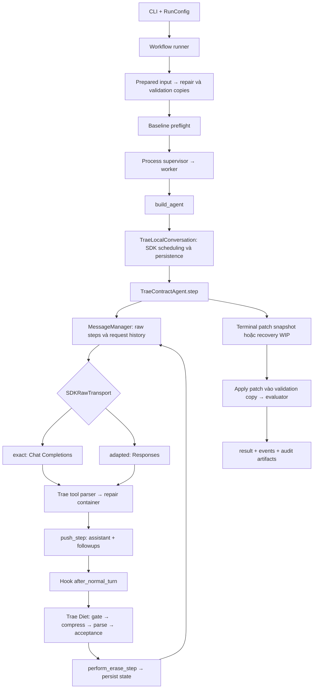

# Kiến trúc Agent Diet adaptation cho OpenHands: `exact` và `adapted`

Tài liệu này mô tả implementation trong `src/openhands_adapter`, đối chiếu ngày
07/10/2026. Mục tiêu là xác định adaptation được gắn ở đâu, dữ liệu nào bị thay
đổi, khác biệt giữa hai transport và bằng chứng cần đọc để kiểm soát một run.
Các đường dẫn dưới đây tương đối với thư mục chứa tài liệu.

## 1. Phân biệt hai trục cấu hình

`reference_profile` chọn **agent workflow**; `transport_conformance` chọn
**cách gửi request và giao thức nhận kết quả nén**. Hai trục này không đồng nghĩa.

| Cấu hình | Agent và nguồn history | Điểm gắn Diet | Transport |
|---|---|---|---|
| `trae_verified + exact` | `TraeContractAgent`, `MessageManager`; 50 repair turns, có reminder | Hook sau turn bình thường | API-key, raw Chat Completions |
| `trae_multiswe + exact` | Như trên; 100 turns, không budget reminder | Cùng hook | API-key, raw Chat Completions |
| Hai profile Trae + `adapted` | Cùng agent/history/turn rules với exact | Cùng hook và thuật toán Diet | Subscription, Responses, wrapper nén đầy đủ |
| `generic` | Stock OpenHands `Agent`, SDK event view | SDK `CondenserBase` | Public SDK API; không phải hai luồng Trae trên |

`adapted` chỉ hợp lệ khi auth là `subscription` và profile là Trae.
`exact` với profile Trae từ chối subscription. `generic + exact` không phải
cam kết tương đương Trae: `uses_trae_workflow` vẫn là false.

Điểm chọn nhánh: [config.py](config.py), các property `uses_trae_workflow`,
`requires_exact_transport`, `scheduling_limit`; [openhands/agent.py](openhands/agent.py),
hàm `build_agent()`.

**Chi tiết dễ hiểu nhầm:** `AgentDietCondenser(exact_trae=...)` nhận
`openhands.uses_trae_workflow`, vì vậy flag nội bộ này true cho cả exact và
adapted. Nó biểu thị dùng thuật toán/history Trae, không chứng nhận exact transport.

## 2. Các lớp và quyền sở hữu



| Thành phần | Trách nhiệm cụ thể |
|---|---|
| `workflow/runner.py` | Preflight, workspace copies, nhận patch, validation, result và audit finalization |
| `openhands/process.py`, `worker.py` | Worker subprocess, watchdog tùy chọn, tạo conversation, lưu artifacts và cleanup |
| `openhands/trae_agent.py` | Một repair response mỗi SDK step; chuyển trạng thái Trae và gọi hook Diet |
| `compat/trae_contract.py::MessageManager` | Sở hữu `steps`, serialize request, dựng trajectory nén, thay step |
| `compat/trae_diet.py` | Candidate window, threshold/LZ4, strategy, acceptance và parser exact |
| `openhands/compressor.py` | Gọi compression role; chọn parser/prompt theo transport |
| `openhands/trae_transport.py` | Payload, auth/routing SDK, retry, response normalization |
| `compat/trae_llm_policy.py` | Role parameters dựa trên reference model và kiểm tra capabilities |
| `compat/audit.py`, `events.py` | Identity/hash/retention, audit records và verifier |

OpenHands SDK 1.49.5 quản lý scheduling, conversation state, persistence và
telemetry/auth. **Repair transitions, tools, prompt và history do custom
`TraeContractAgent` quản lý.** Đây không phải chỉ cắm Diet vào stock OpenHands
agent. Hai nhánh Trae không tái dựng model history từ SDK events.

Khi build agent Trae: `tools=[]`, `include_default_tools=[]`, `agent_context=None`,
`condenser=None`, `critic=None`, concurrency 1. Bộ tool Trae được gửi trực tiếp
qua `TOOLS`: `think`, `bash`, `str_replace_editor`, `task_done`, `task_failed`.
Parser gọi wrappers trong repair container; stock SDK tool conversion không tham gia.
`TraeLocalConversation` bỏ ambient plugin loading và file-based agents;
stuck detection bị tắt. SDK scheduling limit là 51/101 để có thêm bước capture
patch khi đạt cap 50/100, không phải thêm một repair model call.

## 3. Luồng chung của exact và adapted

### 3.1. Chuẩn bị

1. CLI nạp JSON/env rồi áp dụng CLI overrides; model phải truyền rõ bằng `--model`.
2. Validate profile, auth, role policy và Diet trước generation. Cả hai nhánh
   Trae yêu cầu Docker với local Unix endpoint.
3. Copy input thành repair workspace và validation workspace độc lập.
4. Baseline kiểm tra input/runtime/image/workspace và Git baseline; không chạy
   full setup/build/test suite.
5. `build_agent()` tạo repair LLM, compression LLM nếu `enabled && mode == ours`,
   hai role transports, `AgentDietCondenser`, rồi bind
   `after_normal_turn=condenser.after_normal_turn` vào custom agent.
6. Worker tạo conversation mới, gửi initial user prompt, rồi `conversation.run()`.

Issue Trae lấy từ `problem_statement`, hoặc nguyên nội dung UTF-8 failure log.
Trae không nhận `--prompt`/`--prompt-file` overrides.
Compression model `inherit` dùng cùng LLM object với repair nhưng vẫn có role
policy và request riêng; không có nghĩa là nén miễn phí hoặc gộp vào repair call.
Trong `ours`, phải khai báo compressor model rõ ràng, kể cả chủ đích `inherit`,
cho cả exact và adapted.

### 3.2. Một repair turn

1. Khôi phục `MessageManager` từ `state.agent_state['trae_contract']`:
   user message, steps, `last_analyzed_turn`, Diet metrics.
2. Nếu đạt cap: capture patch và kết thúc `turn_capped`, không gọi model.
3. `format_messages()` dựng system + initial user + flattened steps, bỏ các
   field nội bộ `agent_*`, thêm cache/reminder theo source rules.
4. Emit `trae_request`, gọi repair transport, emit `trae_response`.
5. Nếu completion usage có giá trị, parse tool calls và thực thi tools. Một
   `task_done` đơn lẻ với patch không rỗng kết thúc; patch rỗng tạo followup để
   agent tiếp tục. Một `task_failed` đơn lẻ kết thúc. Tool timeout có thể restart session.
6. `push_step(answer, followups)` thêm **một logical step**, gồm assistant message
   và tất cả followups của turn. Tool call và kết quả thuộc cùng step.
7. Ghi SDK message event và persist snapshot.
8. Chỉ khi chưa terminal (`gen is None`), gọi hook Diet rồi persist lại history
   đã thay đổi. Vì vậy turn terminal không được chạy Diet hook.

Mã quyết định thứ tự này: `TraeContractAgent._step()`. SDK message event là
archive; `MessageManager` mới là nguồn request kế tiếp.

## 4. Diet thay history như thế nào?

Điểm thực thi là `AgentDietCondenser.after_normal_turn()` →
`compat.trae_diet.analyze_turn()`, **không phải** `AgentDietCondenser.condense()`.

Gọi `T = len(mgr.steps)`, indices bắt đầu từ 0:

```text
target_idx = T - 1 - ctx_after
window = steps[target_idx - ctx_before ... T - 1]
```

Defaults: `ours`, threshold 500 tokens, `ctx_before=1`, `ctx_after=2`,
`show_ctx=true`, `use_lz4=false`. Sau turn thứ 4 (`T=4`), target là step 1;
window gồm step 0, 1, 2, 3. Với `T=3`, window bắt đầu ở -1: index -1 là initial
user text trong source contract, không phải một repair turn.

Thứ tự xử lý:

1. Disabled/skip: giữ history. Turn đã phân tích: không phân tích lại.
2. Nếu `T < ctx_before + ctx_after`: chưa đủ window.
3. Serialize target/window bằng `extract_step_into_traj()`: `<step>`,
   `<think>`/`<talk>`, `<call>`, `<result>`; token count dùng encoding `gpt-4o`.
4. Nếu target tokens < threshold: reject `below_threshold`; bằng threshold thì qua.
5. Nếu LZ4 bật: đo chênh compressed bytes khi có/không có target trong suffix
   context; chỉ qua khi estimated saved tokens ≥ threshold.
6. Với `ours`, dựng lại compression window theo `policy.bypass_filter` của
   **compressor reference model**. Predicate literal là chuỗi `gpt-5-`:
   đổi representation/prompt `think` → `talk`, `agent` → `engineer`.
   Gate target và compressor target vì vậy có thể có token count khác nhau.
   `show_ctx=false` chỉ ẩn surrounding context khỏi compressor, không bỏ gate.
7. Gọi compressor và parser tương ứng exact/adapted.
8. Chấp nhận `ours` khi **một trong hai** điều kiện đúng:

   ```text
   old_tokens - new_tokens >= 400 OR new_tokens < 0.8 * old_tokens
   ```

   Đây là OR; giảm đúng 20% không thỏa vế ratio strict, nhưng vẫn có thể thỏa
   vế 400 tokens. Hai giá trị acceptance bị cố định trong cả hai profile Trae.
9. Nếu accepted: `perform_erase_step(idx, replacement, original)` thay toàn bộ
   step bằng một assistant reminder chứa nội dung nén; delete dùng reminder xóa.
10. Persist history. Repair request kế tiếp chứa reminder thay cho assistant/tool
    messages cũ của step đó.

Ví dụ biến đổi:

```text
Trước: steps[1] = [assistant(tool_calls=[...]), tool(output=...)]
Sau:   steps[1] = [{role: assistant,
                   content: '(System reminder: compressed for better efficiency) ...',
                   agent_erased: original_trajectory}]
```

`agent_erased` giữ nguyên bản cho những lần dựng compression context sau;
`format_messages()` loại nó khỏi repair request. Nén history không chạy lại tool,
không hoàn tác sửa file và không xóa bằng chứng audit đã lưu.

Modes `delete`, `random`, `lingua` dùng cùng candidate gates nhưng không gọi LLM
compressor và không áp acceptance `ours`. `ctx_before=0 && ctx_after>0` bị reject.
`ctx_after=0` giữ literal slicing behavior của source; không nên suy diễn thành
phiên bản heuristic đã được sửa riêng cho OpenHands.

Trong nhánh Trae, compressor exception lan ra và kết thúc `generation_error`;
parser trả `skipped` hoặc reduction không đủ thì giữ step. Điều này khác generic,
nơi `condense()` bắt compressor exception và giữ view để tiếp tục.

## 5. Luồng exact: bảo toàn raw Chat contract

```text
MessageManager.format_messages()
 → SDKRawTransport._exact_chat()
 → SDK lấy auth/routing qua _prepare_transport_kwargs()
 → OpenAI client.chat.completions.create(raw body)
 → raw assistant / finish reasons / usage
 → Trae tool parser hoặc exact compression parser
```

Exact dùng SDK cho auth/routing/telemetry, nhưng serializer OpenAI trực tiếp
để tránh LiteLLM tự đổi params/cache theo actual model. Raw roles, tool schemas,
JSON arguments, cache blocks và compression assistant continuation được giữ.

`TraeLLMPolicy.params()` chọn theo **reference model**, không phải actual model:

| Role với reference mặc định | Params |
|---|---|
| Repair `claude4-sonnet` | `max_tokens=8192`, `n=1`, `temperature=0.0`, tools |
| Compression `gpt-5-mini-2025-08-07` | `max_tokens=8192`, `n=1`, `reasoning_effort=low`; không temperature/stop |
| Compression không match `gpt-5-` | `max_tokens=8192`, `n=1`, `temperature=0.0`, `stop='</step>'` |

Compression prompt exact gồm system (ephemeral cache block), user trajectory,
assistant prefill mở `<step id="idx">`. Parser exact giữ heuristic source:
partition ở `</step>`; có thể chấp nhận thiếu closing nếu finish reasons có `stop`;
strip opening tag theo heuristic 200/20 ký tự, không kiểm tra step ID nghiêm ngặt.
Adapted dùng chung parser này. Completion usage None tạo `skipped`; malformed
envelope có thể lỗi.

Preflight yêu cầu khai báo endpoint capabilities; với reference defaults cần
`max_tokens,n,temperature,tools,reasoning_effort,cache_control,assistant_prefill`.
Compressor non-GPT-5 cần thêm `stop`. Đây là khai báo semantics đã xác nhận từ
endpoint, không phải adapter tự chứng minh provider hỗ trợ.

Retry: tối đa 12 attempts cho một logical request, inner retries = 0, backoff
`2**retries`, không completed-response cache. Exact telemetry/downstream parsing
nằm ngoài retry; parser lỗi không tự gọi lại provider.

## 6. Luồng adapted: giữ workflow, chiếu request sang Responses

```text
MessageManager.format_messages()
 → project_messages(): text blocks thành string, bỏ cache metadata
 → responses_payload(): system → instructions; history → input items
 → SDK subscription credential refresh/routing
 → LiteLLM Responses streaming request
 → drain SSE → responses_answer()
 → cùng Trae history/tool/Diet algorithm
```

Biến đổi tại transport:

| Chat contract | Responses projection |
|---|---|
| Leading system content | `instructions` |
| User/assistant text | `input` message item |
| Assistant tool call | `function_call`, giữ `call_id`, name, raw arguments string |
| Tool result | `function_call_output` với cùng `call_id` |
| Tool schema | Responses function schema, `strict=false` |
| Request state | `stream=true`, `store=false`, không dùng `previous_response_id` |
| Configured effort | Gửi rõ `reasoning: {effort: ...}` nếu có |

Responses result được quy về assistant/tool calls + finish reason + usage.
Tool-only repair response có `content=None` được đổi thành chuỗi rỗng trong
adapted history để serializer Trae xử lý được; raw provider response vẫn được
ghi trước normalization đó. SSE giữ output items từ `output_item.done` nếu
terminal response có output rỗng. Incomplete/failure được xử lý rõ, không coi
mọi stream kết thúc là success.

Những khác biệt với exact được báo trong capability report:

- Không bảo toàn cap `max_tokens=8192`, `n`, temperature và server stop của source.
- Cache metadata Chat bị bỏ.
- Không dùng assistant prefill. Compression prompt chỉ gồm system + user,
  yêu cầu trả đúng một wrapper đầy đủ `<step id="idx">...</step>`.
- Prompt `responses-step-wrapper-v1` vẫn yêu cầu wrapper đầy đủ, nhưng parser
  dùng chung `compat.trae_diet.parse_response()` với Trae: lấy phần trước
  `</step>`, bỏ phần sau, strip opening tag theo heuristic 200/20 ký tự.
  Thiếu closing vẫn được nhận nếu finish reason là `stop`; có closing thì
  không reject chỉ vì finish reason khác `stop`. Không kiểm tra đúng step ID,
  nested tags hoặc nội dung rỗng riêng; acceptance gate Diet vẫn chạy sau parser.
- `reasoning.effort` được serialize nhưng semantics tại live endpoint vẫn cần
  bằng chứng riêng; field có trong payload không đủ chứng minh model áp dụng nó.

Retry vẫn 12 attempts/inner retries 0. Trong adapted, drain và Responses envelope
normalization nằm trong attempt; compression parsing nằm sau transport.
Thuật toán chọn step, parser và acceptance giữ Trae; D07/D08 khác transport,
D11 vẫn không được chứng nhận exact parity cho toàn bộ giao thức adapted.

## 7. Cách kiểm soát adaptation của một run

### 7.1. Đọc artifacts theo thứ tự

| Artifact | Câu hỏi kiểm tra |
|---|---|
| `protocol-manifest.json` | Exact hay adapted? Actual/reference/wire model từng role? Compression active? Params/capability deviations? |
| `audit/manifest.json`, `contract-manifest.json` | Effective config, runtime controls, SDK/implementation/lock hashes, run/case identity, retention và archive |
| `events.jsonl` | Candidate nào, gọi nén gì, parser trả gì, thay step nào, request sau chứa history gì? |
| `contract-result.json` | Persisted steps, metrics, terminal status, patch origin |
| `contract-patch.diff`, `patch.diff`, `recovery-patch.diff` nếu có | Worker snapshot, submitted patch, hoặc WIP thu hồi khi lỗi/abort |
| `audit/conformance-report.json` | Integrity errors, source-oracle evidence và limitations |
| `result.json`, `logs/validation/` | Patch có qua evaluator trên validation copy không? |

Muốn đọc before/after và payload thực tế, giữ `keep_raw_events=true` (mặc định);
không truyền `--discard-raw-events`. Hash-only chỉ đủ kiểm tra integrity, không
đủ tái dựng toàn bộ history. Raw artifacts vẫn qua credential sanitizer; preview
trong action logs không thay thế full source evidence.

### 7.2. Theo dõi một lần nén từ đầu tới request sau

Lọc theo run/case, `logical_turn`, `step_index`, `request_id`/role và
`compression_request_id` khi có:

```text
trae_after_normal_turn
 → diet_gate [target/window/token threshold]
 → diet_lz4_gate [nếu bật]
 → diet_analysis_started
 → trae_llm_request [role=compression: prompt/payload]
 → trae_transport_attempt / trae_provider_response
 → diet_compressor_response / diet_compressor_usage
 → diet_parser_result
 → diet_reduction_gate
 → diet_step_change [status=accepted, before/after, next_repair_messages]
 → diet_decision / diet_reference_metrics
 → trae_contract_state [steps đã thay đổi]
 → trae_request kế tiếp [history đã nén]
 → trae_llm_request [role=repair: payload sẽ gửi]
```

Gate fail/parser skip thì chuỗi dừng trước `diet_step_change` accepted; dùng
`diet_decision.reason` và metrics `rejected` để tìm lý do.

**Mức bằng chứng:**

1. `configured`: có gắn hook, chưa chứng minh có candidate.
2. Compression request: chứng minh đã gọi compressor, chưa chứng minh đã thay history.
3. `diet_step_change accepted` + persisted state: chứng minh đã thay local history.
4. `trae_request` kế tiếp + repair payload: chứng minh history nén đã đi vào
   request tiếp theo. Với adapted, so sánh sau Responses projection, không so
   Chat dict với Responses dict bằng byte equality.
5. Provider response/live evidence: đánh giá riêng endpoint semantics và hành vi model.

`erase_count > 0` chỉ là chỉ báo thay step; nếu run dừng trước repair request
tiếp theo thì chưa chứng minh model đã dùng nội dung nén. Reduction metrics đếm
step text trước/sau, không phải tổng token saving của cả run: reminder, wrappers,
surrounding context và chi phí compression cũng tiêu tốn tokens.

### 7.3. Chạy verifier và kiểm tra implementation

Từ thư mục `Agent-Diet`:

```bash
PYTHONPATH=src .venv-openhands/bin/python -m openhands_adapter.compat.audit \
  output/<run>/<case> --expected-profile trae_verified --full
```

`--full` yêu cầu raw evidence không redact. Có thể thêm `--oracle <fixture.json>`
để đối chiếu với fixture source độc lập. Verifier không gọi model hoặc resume.
Exact integrity pass không tự chứng nhận toàn bộ source/provider parity;
adapted không có integrity errors vẫn báo `partial`, các contract D07/D08/D11
được đánh dấu unsupported cho exact parity.

Các test cần xem khi review adaptation:

| Phần cần kiểm soát | Tests |
|---|---|
| History serialization và nguyên bản step | `test_trae_contract_diet_serialization.py` |
| Candidate, LZ4, acceptance | `test_trae_contract_diet_algorithm.py` |
| Prompt/role params/prefill | `test_trae_contract_compressor_payload.py`, `test_trae_contract_llm_policy.py` |
| Exact parser/retry | `test_trae_contract_diet_parser.py`, `test_trae_contract_llm_retry.py` |
| Hook, turn, persisted request history | `test_trae_contract_diet_integration.py`, `test_trae_contract_turns.py` |
| Responses projection, adapted wrapper, audit không được relabel exact | `test_subscription_adapted.py` |
| Bundle integrity/retention | `test_audit_integrity.py`, `test_audit_retention.py` |

Ví dụ kiểm tra local bằng test có sẵn, không gọi live provider:

```bash
PYTHONPATH=src:tests .venv-openhands/bin/python -m unittest \
  test_trae_contract_diet_serialization test_trae_contract_diet_algorithm \
  test_trae_contract_compressor_payload test_trae_contract_diet_parser \
  test_trae_contract_diet_integration test_subscription_adapted
```

## 8. Cấu hình chạy rõ ràng

Cài SDK bằng `./setup_openhands.sh`; runtime kiểm tra đúng pin 1.49.5.
Chạy các lệnh từ thư mục `Agent-Diet`, nơi có `src/` và `.venv-openhands/`.

### 8.1. Đăng nhập OpenHands bằng ChatGPT subscription

Subscription dùng OAuth của OpenHands SDK (vendor mặc định `openai`); không cần
API key và không cấu hình `--base-url`. Lần đầu, cài môi trường rồi chạy login
riêng trước khi chạy batch:

```bash
cd Agent-Diet
./setup_openhands.sh

# Mặc định mở browser để đăng nhập tài khoản ChatGPT có subscription phù hợp.
PYTHONPATH=src .venv-openhands/bin/python -m openhands_adapter.cli \
  --login-only --model gpt-5.6-sol --auth subscription \
  --reference-profile trae_verified --transport-conformance adapted
```

Hoàn tất bước OAuth trong browser được mở ra rồi quay lại terminal. Nếu máy
không mở được browser (ví dụ SSH/headless), dùng device-code flow và làm theo
hướng dẫn được in trong terminal:

```bash
PYTHONPATH=src .venv-openhands/bin/python -m openhands_adapter.cli \
  --login-only --model gpt-5.6-sol --auth subscription \
  --reference-profile trae_verified --transport-conformance adapted \
  --subscription-auth-method device_code
```

`--login-only` chỉ xác thực, không cần `--input` và không chạy case. Khi cần
đăng nhập lại hoặc đổi tài khoản, thêm `--force-login`; tùy chọn này yêu cầu
OpenHands thực hiện OAuth thay vì dùng phiên đã lưu:

```bash
PYTHONPATH=src .venv-openhands/bin/python -m openhands_adapter.cli \
  --login-only --model gpt-5.6-sol --auth subscription \
  --reference-profile trae_verified --transport-conformance adapted \
  --force-login
```

Sau khi đăng nhập, chạy lệnh từ cùng máy và cùng user OS để OpenHands dùng
credential subscription đã thiết lập. Nếu chạy trong container/CI khác, cần
thực hiện login trong đúng môi trường đó. Có thể dùng
`--subscription-auth-method device_code` hoặc `browser` trên lệnh chạy thật để
chọn flow; mặc định là `browser`.

### 8.2. Chạy agent

Các lệnh dưới đây là mẫu; thay input/case/model/endpoint cho phù hợp, không phải
bằng chứng đã chạy live. Với exact, chỉ khai báo capabilities đã xác nhận.

```bash
# Exact; default reference models; endpoint phải giữ contract các field đã khai báo.
PYTHONPATH=src .venv-openhands/bin/python -m openhands_adapter.cli \
  --input /path/to/prepared-inputs --case <case-id> \
  --model <repair-model> --auth api-key --base-url <compatible-endpoint> \
  --reference-profile trae_verified --transport-conformance exact \
  --trae-capabilities max_tokens,n,temperature,tools,reasoning_effort,cache_control,assistant_prefill \
  --diet-mode ours --compressor-model <compressor-model> --output inspect-exact

# Adapted; cần hoàn tất đăng nhập subscription ở mục 8.1 trước.
PYTHONPATH=src .venv-openhands/bin/python -m openhands_adapter.cli \
  --input /path/to/prepared-inputs --case <case-id> \
  --model gpt-5.6-sol --auth subscription \
  --reference-profile trae_verified --transport-conformance adapted \
  --diet-mode ours --compressor-model gpt-5.6-luna \
  --reasoning-effort low --output inspect-adapted

# Lệnh batch đã dùng cho PHP inputs:
PYTHONPATH=src .venv-openhands/bin/python -m openhands_adapter.cli \
  --input ../defects4c/out_tmp_dirs/debugging_framework/php/inputs \
  --all-cases \
  --output php_solxluna \
  --model gpt-5.6-sol \
  --auth subscription \
  --reference-profile trae_verified \
  --transport-conformance adapted \
  --diet-mode ours \
  --compressor-model gpt-5.6-luna \
  --agent-timeout 1800
```

Defaults cần lưu ý: profile Trae + transport exact + auth subscription không
đủ điều kiện chạy; phải chọn auth API-key cho exact hoặc chủ động chọn adapted.
`--min-reduction-*` không được override khỏi 400/0.20 trong hai nhánh Trae.
Watchdog mặc định tắt; `--agent-timeout N` là giới hạn harness bổ sung, có thể
dừng trước turn cap. Một số nội dung trong `adapter.md` và entry
`exact positive watchdog` trong `compat/diet_conformance.json` chưa phản ánh
runtime hiện tại; kiểm tra `config.py`, `validate_runtime_controls()` và manifest
thực tế khi review, không lấy các mô tả cũ làm bằng chứng.

## 9. Validation và giới hạn của chứng nhận

Capture patch Trae dùng terminal snapshot, lọc test patches theo source helper.
Nếu generation lỗi hoặc harness abort, runner có thể capture recovery WIP và
vẫn đưa patch qua evaluator; `patch_origin` ghi rõ nguồn. Vì vậy `resolved=true`
không chứng minh generation thành công hay exact conformance.

Patch được kiểm tra và apply vào validation copy sạch. Evaluator chạy
setup/build/target/regression theo prepared config, lấy test evidence để quyết
định verdict; final answer của model không quyết định kết quả sửa lỗi.

Giữ riêng ba kết luận khi nghiệm thu:

- **Generation:** turn/tool/history/compression và stop reason thực tế.
- **Repair outcome:** submitted patch qua validation như thế nào.
- **Conformance:** integrity, đối chiếu frozen-source fixture, container evidence
  và live provider evidence tới đâu.

Các báo cáo [README](../../README.md),
[D09–D11](../../analysis/implementation_d09_d11.md),
[D14](../../analysis/implementation_d14.md) và
[diet_conformance.json](compat/diet_conformance.json) lưu phạm vi kiểm chứng
local/source/container; chúng không tự chứng minh live model repair.
Manifest còn ghi `provider_semantics_verified_by_adapter=false`.

Nhánh generic có audit riêng qua `diet_sdk_condensation` và
`diet_application_check`: SDK forget event IDs, thêm summary rồi kiểm tra view
sau apply. Không dùng các event đó làm điều kiện xác nhận exact/adapted;
hai luồng Trae chứng minh adaptation bằng persisted raw steps và repair payload
kế tiếp như mục 7.

### Kiểm tra khi viết tài liệu (07/10/2026)

- Các liên kết file trong tài liệu đều tồn tại.
- 8 test adapted về config, wire repair/compression, effort, tool-only history,
  retry và wrapper parser pass bằng mock/local transport; không gọi live model.
- Bộ 6 module ở mục 7.3 chạy 54 test methods nhưng chưa pass: có 79 error
  records và 1 failure. Tracebacks cho thấy tokenizer `o200k_base` chưa có cache,
  không tải được vì DNS/network; bundle audit raw báo `incomplete audit`.
  Không dùng lần chạy này để xác nhận toàn bộ Diet/source parity. Cần chuẩn bị
  tokenizer cache và chạy lại trước khi nghiệm thu algorithm/integration.

Log lần chạy riêng 8 test: `/tmp/apr-agentdiet-architecture-tests.log` (log tạm,
không phải retained conformance bundle).
